# 🔐 SecureVault Password Manager

<div align="center">

**A Modern, Cross-Platform Password Manager with Advanced Security & AI-Powered Features**


[Features](#-key-features) • [Architecture](#-system-architecture) • [Setup](#-quick-start) • [API](#-api-documentation) • [Security](#-security-features) • [Deployment](#-deployment)

</div>

---

## 📋 Table of Contents

- [Overview](#-overview)
- [Key Features](#-key-features)
- [System Architecture](#-system-architecture)
- [Complete System Architecture Diagram](#-complete-system-architecture-diagram)
- [Authentication Flow Diagrams](#-authentication-flow-diagrams)
- [Data Flow Diagrams](#-data-flow-diagrams)
- [Entity Relationship Diagrams](#-entity-relationship-diagrams)
- [Zero-Knowledge Security Architecture](#-zero-knowledge-security-architecture)
- [Technology Stack](#-technology-stack)
- [Project Structure](#-project-structure)
- [Detailed Project Files Structure](#-detailed-project-files-structure)
- [Quick Start](#-quick-start)
- [Encryption & Decryption](#-encryption--decryption-mechanisms)
- [Client-Side Encryption](#-client-side-encryption)
- [CRYSTALS-Kyber Optimizations](#-crystals-kyber-optimizations)
- [Fully Homomorphic Encryption (FHE)](#-fully-homomorphic-encryption-fhe)
- [Backend Optimizations](#-backend-optimizations)
- [Authentication & Authorization](#-authentication--authorization)
- [Passkey Recovery System](#-passkey-recovery-system)
- [Master Password Recovery](#-master-password-recovery)
- [API Documentation](#-api-documentation)
- [Deployment](#-deployment)
- [File Descriptions](#-file-descriptions)
- [Contributing](#-contributing)
- [License](#-license)

---

## 🎯 Overview

SecureVault is a **next-generation password manager** that combines cutting-edge security practices with artificial intelligence to provide unparalleled protection for your digital credentials. Built with a **zero-knowledge architecture**, your data is encrypted client-side, ensuring that even we cannot access your passwords.

### What Makes SecureVault Different?

| Feature | Description |
|---------|-------------|
| 🧠 **AI-Powered Security** | ML models for password strength prediction, anomaly detection, and threat analysis |
| 🔒 **Zero-Knowledge** | Client-side encryption with WebCrypto API; server never sees plaintext data |
| 🚀 **Cross-Platform** | Web, Desktop (Windows/Mac/Linux), Mobile (iOS/Android), Browser Extensions |
| 🔑 **WebAuthn/Passkeys** | Modern passwordless authentication with biometric support |
| 🛡️ **Post-Quantum Ready** | Optimized Kyber-768 with NTT acceleration (6-8x faster) |
| 🔐 **FHE Encryption** | Fully Homomorphic Encryption for server-side computation on encrypted data |
| 🔄 **Advanced Recovery** | Primary recovery key + Social mesh fallback with behavioral biometrics |
| ⛓️ **Blockchain Anchoring** | Immutable audit trail on Arbitrum Sepolia |
| ⚡ **Performance Optimized** | Multi-level caching, Gzip/Brotli compression, async operations |
| 🔐 **Adaptive Security** | Device-aware Argon2id parameters (32-128MB based on capability) |

---

## ✨ Key Features

### 🔐 Core Security Features

| Feature | Technology | Description |
|---------|------------|-------------|
| **End-to-End Encryption** | AES-GCM-256 + XChaCha20-Poly1305 | Dual cipher support with authenticated encryption |
| **Zero-Knowledge Architecture** | WebCrypto API + Client-side | Server never sees plaintext passwords |
| **Argon2id Key Derivation** | Adaptive Memory-hard KDF | 32-128MB memory with device capability detection |
| **Post-Quantum Cryptography** | CRYSTALS-Kyber-768 (Optimized) | NIST Level 3 quantum resistance with NTT acceleration |
| **Hybrid Encryption** | Kyber + X25519 | Defense in depth with combined shared secrets |
| **WebAuthn/FIDO2** | Passkey authentication | Hardware-backed passwordless login |
| **Multi-Factor Auth** | TOTP, SMS, Email, Push | Multiple 2FA options |
| **Biometric Auth** | Face, Voice, Fingerprint | Native biometric support |
| **Continuous Auth** | Behavioral biometrics | 247-dimensional behavioral DNA |
| **Hardware Security** | YubiKey compatible | Hardware key support |
| **FHE Operations** | Concrete-Python + TenSEAL | Server-side computation on encrypted data |
| **Adaptive FHE** | Intelligent routing | Auto-selects optimal FHE tier based on operation |
| **NTT Optimization** | NumPy vectorization | 6-8x faster Kyber polynomial operations |
| **Response Compression** | Gzip + Brotli | 10-50% network payload reduction |
| **Multi-Level Caching** | L1 Memory + L2 Redis | Sub-millisecond response times |

### 🤖 Machine Learning Features

| Feature | Model | Description |
|---------|-------|-------------|
| **Password Strength** | LSTM Neural Network | Real-time strength prediction |
| **Anomaly Detection** | Isolation Forest + Random Forest | Session behavior analysis |
| **Threat Analysis** | CNN-LSTM Hybrid | Multi-vector threat detection |
| **Dark Web Monitoring** | BERT + Siamese Networks | Credential breach detection |
| **Behavioral Profiling** | Transformer (247-dim) | User behavior learning |
| **Smart Suggestions** | ML-powered | Context-aware recommendations |

### 🌐 Multi-Platform Support

```
┌─────────────────────────────────────────────────────────────────────┐
│                         SECUREVAULT PLATFORMS                       │
├─────────────────┬──────────────┬─────────────┬─────────────────────┤
│   Web App       │   Desktop    │   Mobile    │   Browser Extension │
│   (React 18)    │  (Electron)  │   (Expo)    │   (Manifest v3)     │
│                 │              │             │                     │
│ • Vite bundler  │ • Windows    │ • iOS       │ • Chrome            │
│ • TensorFlow.js │ • macOS      │ • Android   │ • Firefox           │
│ • PWA support   │ • Linux      │ • Biometric │ • Edge              │
│ • WebAuthn      │ • Auto-lock  │ • Push      │ • Safari            │
└─────────────────┴──────────────┴─────────────┴─────────────────────┘
```

### 📦 Data Management Features

- **Encrypted Vault Storage** - Secure credential storage
- **Automatic Backup & Restore** - Scheduled and on-demand backups
- **Cross-Device Sync** - Real-time synchronization
- **Import/Export** - LastPass, 1Password, Bitwarden, CSV support
- **Emergency Access** - Trusted contacts with waiting period
- **Shared Folders** - Team collaboration with RBAC
- **Folder Organization** - Nested folders, tags, favorites
- **Email Masking** - SimpleLogin, AnonAddy integration

---

## 🏗️ System Architecture

### High-Level Architecture Diagram

```
┌────────────────────────────────────────────────────────────────────────────────┐
│                              CLIENT LAYER                                       │
├────────────────┬───────────────┬───────────────┬───────────────────────────────┤
│    Web App     │    Desktop    │    Mobile     │       Browser Extension       │
│   (React 18)   │  (Electron)   │ (React Native)│        (Manifest v3)          │
│                │               │               │                               │
│ ┌────────────┐ │ ┌───────────┐ │ ┌───────────┐ │ ┌─────────────────────────────┤
│ │ TensorFlow │ │ │  Native   │ │ │ Biometric │ │ │  Auto-fill Engine           │
│ │    .js     │ │ │  Keychain │ │ │   Auth    │ │ │  Password Capture           │
│ ├────────────┤ │ ├───────────┤ │ ├───────────┤ │ ├─────────────────────────────┤
│ │  Kyber-768 │ │ │ Secure    │ │ │   Push    │ │ │  Context Menu               │
│ │  (PQC)     │ │ │ Storage   │ │ │   Notif   │ │ │  Form Detection             │
│ └────────────┘ │ └───────────┘ │ └───────────┘ │ └─────────────────────────────┤
└───────┬────────┴───────┬───────┴───────┬───────┴───────────────┬───────────────┘
        │                │               │                       │
        └────────────────┴───────────────┴───────────────────────┘
                                    │
                          HTTPS/TLS 1.3 + WSS
                                    │
                        ┌───────────▼───────────┐
                        │     NGINX GATEWAY     │
                        │  (Load Balancer/SSL)  │
                        └───────────┬───────────┘
                                    │
            ┌───────────────────────┼───────────────────────┐
            │                       │                       │
    ┌───────▼───────┐       ┌───────▼───────┐       ┌───────▼───────┐
    │   Gunicorn    │       │    Daphne     │       │   Static      │
    │   (REST API)  │       │  (WebSockets) │       │   Files       │
    │   Port: 8000  │       │   Port: 8001  │       │   Port: 80    │
    └───────┬───────┘       └───────┬───────┘       └───────────────┘
            │                       │
            └───────────┬───────────┘
                        │
            ┌───────────▼───────────────────────────────────────┐
            │                 DJANGO BACKEND                     │
            ├─────────────┬─────────────┬─────────────┬─────────┤
            │ Auth Module │   Vault     │  Security   │   ML    │
            │             │   Service   │   Service   │ Engine  │
            │ • JWT Auth  │ • CRUD      │ • Breach    │ • LSTM  │
            │ • WebAuthn  │ • Backup    │   Monitor   │ • CNN   │
            │ • OAuth 2.0 │ • Sync      │ • MFA       │ • BERT  │
            │ • MFA       │ • Folders   │ • Audit     │ • IF    │
            │ • Recovery  │ • Sharing   │ • Session   │ • Siamese│
            └──────┬──────┴──────┬──────┴──────┬──────┴────┬────┘
                   │             │             │           │
    ┌──────────────┼─────────────┼─────────────┼───────────┼──────────┐
    │              │             │             │           │          │
┌───▼───┐    ┌─────▼─────┐  ┌────▼────┐  ┌────▼────┐  ┌───▼────┐    │
│ Celery│    │ PostgreSQL│  │  Redis  │  │ Channels│  │Arbitrum│    │
│Worker │    │    DB     │  │ Cache   │  │  Layer  │  │Sepolia │    │
│       │    │           │  │         │  │         │  │        │    │
│Tasks: │    │• Encrypted│  │• Session│  │• Breach │  │• Merkle│    │
│• Email│    │  Vault    │  │• Cache  │  │  Alerts │  │  Roots │    │
│• ML   │    │• pgvector │  │• Broker │  │• RT Sync│  │• Proofs│    │
│• Notif│    │• Audit Log│  │• Rate   │  │         │  │        │    │
└───────┘    └───────────┘  └─────────┘  └─────────┘  └────────┘    │
                                                                     │
└────────────────────────────────────────────────────────────────────┘
```

---

## 🗺️ Complete System Architecture Diagram

### Full-Stack Architecture with All Components

```
╔══════════════════════════════════════════════════════════════════════════════════════════════════════════════════╗
║                                          SECUREVAULT COMPLETE SYSTEM ARCHITECTURE                                  ║
╠══════════════════════════════════════════════════════════════════════════════════════════════════════════════════╣
║                                                                                                                    ║
║  ┌────────────────────────────────────────── CLIENT TIER ─────────────────────────────────────────────┐           ║
║  │                                                                                                     │           ║
║  │  ┌─────────────────────┐  ┌─────────────────────┐  ┌─────────────────────┐  ┌─────────────────────┐│           ║
║  │  │    WEB APP          │  │    DESKTOP APP      │  │    MOBILE APP       │  │  BROWSER EXTENSION  ││           ║
║  │  │    (React 18)       │  │    (Electron)       │  │  (React Native)     │  │   (Manifest v3)     ││           ║
║  │  │                     │  │                     │  │                     │  │                     ││           ║
║  │  │ ┌─────────────────┐ │  │ ┌─────────────────┐ │  │ ┌─────────────────┐ │  │ ┌─────────────────┐ ││           ║
║  │  │ │ SecureVaultCrypto│ │  │ │  Native Keychain│ │  │ │ Biometric Auth  │ │  │ │ Autofill Engine │ ││           ║
║  │  │ │ • AES-256-GCM    │ │  │ │ • Secure Storage│ │  │ │ • Face ID       │ │  │ │ • Form Detect   │ ││           ║
║  │  │ │ • Argon2id KDF   │ │  │ │ • Auto-Lock     │ │  │ │ • Touch ID      │ │  │ │ • Pwd Capture   │ ││           ║
║  │  │ │ • WebCrypto API  │ │  │ │ • IPC Secure    │ │  │ │ • Push Notifs   │ │  │ │ • Context Menu  │ ││           ║
║  │  │ └─────────────────┘ │  │ └─────────────────┘ │  │ └─────────────────┘ │  │ └─────────────────┘ ││           ║
║  │  │                     │  │                     │  │                     │  │                     ││           ║
║  │  │ ┌─────────────────┐ │  │ ┌─────────────────┐ │  │ ┌─────────────────┐ │  │ ┌─────────────────┐ ││           ║
║  │  │ │ Kyber Service   │ │  │ │ Local DB        │ │  │ │ Expo SecureStore│ │  │ │ Secure Storage  │ ││           ║
║  │  │ │ • Kyber-768     │ │  │ │ • SQLite        │ │  │ │ • Encrypted     │ │  │ │ • chrome.storage│ ││           ║
║  │  │ │ • X25519 Hybrid │ │  │ │ • Auto-sync     │ │  │ │ • Keychain      │ │  │ │ • Local Only    │ ││           ║
║  │  │ │ • WASM Module   │ │  │ │ • Conflict Res  │ │  │ │ • Biometric Key │ │  │ │ • CSP Headers   │ ││           ║
║  │  │ └─────────────────┘ │  │ └─────────────────┘ │  │ └─────────────────┘ │  │ └─────────────────┘ ││           ║
║  │  │                     │  │                     │  │                     │  │                     ││           ║
║  │  │ ┌─────────────────┐ │  ┌────────────────────────────────────────────────┐ │ ┌─────────────────┐ ││           ║
║  │  │ │ FHE Client      │ │  │              SHARED SERVICES LAYER              │ │ │ Pwd Generator   │ ││           ║
║  │  │ │ • TFHE-rs WASM  │ │  │  • IndexedDB Cache  • Web Workers              │ │ │ • Secure Random │ ││           ║
║  │  │ │ • Key Gen       │ │  │  • Service Workers  • Behavioral Capture       │ │ │ • Policy Based  │ ││           ║
║  │  │ │ • Encrypt/Dec   │ │  │  • TensorFlow.js    • Real-time Sync           │ │ │ • Entropy Check │ ││           ║
║  │  │ └─────────────────┘ │  └────────────────────────────────────────────────┘ │ └─────────────────┘ ││           ║
║  │  └─────────────────────┴─────────────────────────────────────────────────────┴─────────────────────┘│           ║
║  └─────────────────────────────────────────────────────────────────────────────────────────────────────┘           ║
║                                                        │                                                            ║
║                                                        │ HTTPS/TLS 1.3 + WebSocket Secure                          ║
║                                                        ▼                                                            ║
║  ┌───────────────────────────────────────── GATEWAY TIER ────────────────────────────────────────────┐             ║
║  │                                                                                                    │             ║
║  │  ┌──────────────────────────────────────────────────────────────────────────────────────────────┐ │             ║
║  │  │                                   NGINX REVERSE PROXY                                         │ │             ║
║  │  │  • SSL/TLS Termination (Let's Encrypt)  • Rate Limiting (100 req/min)                        │ │             ║
║  │  │  • Load Balancing (Round Robin)         • Gzip/Brotli Compression                           │ │             ║
║  │  │  • WebSocket Upgrade Support            • Security Headers (CSP, HSTS)                       │ │             ║
║  │  │  • Static File Caching (365 days)       • Request Buffering & Timeout                       │ │             ║
║  │  └──────────────────────────────────────────────────────────────────────────────────────────────┘ │             ║
║  │                                                                                                    │             ║
║  │         │                                       │                                     │           │             ║
║  │         ▼                                       ▼                                     ▼           │             ║
║  │  ┌─────────────────┐                    ┌─────────────────┐                   ┌─────────────────┐ │             ║
║  │  │  Gunicorn       │                    │    Daphne       │                   │  Static Files   │ │             ║
║  │  │  REST API       │                    │   WebSockets    │                   │  CDN Ready      │ │             ║
║  │  │  Port: 8000     │                    │   Port: 8001    │                   │  Port: 80/443   │ │             ║
║  │  │  Workers: 4     │                    │   Workers: 2    │                   │  Cache: 1 year  │ │             ║
║  │  └─────────────────┘                    └─────────────────┘                   └─────────────────┘ │             ║
║  └────────────────────────────────────────────────────────────────────────────────────────────────────┘             ║
║                                                        │                                                            ║
║                                                        ▼                                                            ║
║  ┌──────────────────────────────────────── APPLICATION TIER ─────────────────────────────────────────┐             ║
║  │                                                                                                    │             ║
║  │  ┌─────────────────────────────────── DJANGO BACKEND ────────────────────────────────────────────┐│             ║
║  │  │                                                                                                ││             ║
║  │  │  ┌──────────────────┐  ┌──────────────────┐  ┌──────────────────┐  ┌──────────────────┐       ││             ║
║  │  │  │   AUTH MODULE    │  │   VAULT SERVICE  │  │ SECURITY SERVICE │  │   FHE SERVICE    │       ││             ║
║  │  │  │                  │  │                  │  │                  │  │                  │       ││             ║
║  │  │  │ • JWT Tokens     │  │ • CRUD Ops       │  │ • Breach Monitor │  │ • Concrete-Py    │       ││             ║
║  │  │  │ • WebAuthn/FIDO2 │  │ • Backup/Restore │  │ • Device Trust   │  │ • TenSEAL SEAL   │       ││             ║
║  │  │  │ • OAuth 2.0      │  │ • Sync Engine    │  │ • Login Tracking │  │ • FHE Router     │       ││             ║
║  │  │  │ • MFA (TOTP/Push)│  │ • Folder Mgmt    │  │ • Alert System   │  │ • Adaptive Depth │       ││             ║
║  │  │  │ • Kyber Crypto   │  │ • Shared Folders │  │ • Dark Web Scan  │  │ • Computation    │       ││             ║
║  │  │  │ • Recovery Flows │  │ • Import/Export  │  │ • Audit Logging  │  │   Cache (Redis)  │       ││             ║
║  │  │  └────────┬─────────┘  └────────┬─────────┘  └────────┬─────────┘  └────────┬─────────┘       ││             ║
║  │  │           │                     │                     │                     │                 ││             ║
║  │  │  ┌──────────────────┐  ┌──────────────────┐  ┌──────────────────┐  ┌──────────────────┐       ││             ║
║  │  │  │ BEHAVIORAL       │  │   ML SECURITY    │  │   BLOCKCHAIN     │  │  EMAIL MASKING   │       ││             ║
║  │  │  │ RECOVERY         │  │                  │  │   ANCHORING      │  │                  │       ││             ║
║  │  │  │                  │  │ • LSTM Strength  │  │                  │  │ • SimpleLogin    │       ││             ║
║  │  │  │ • 247-dim DNA    │  │ • CNN-LSTM Threat│  │ • Merkle Trees   │  │ • AnonAddy       │       ││             ║
║  │  │  │ • Trust Scoring  │  │ • Isolation For. │  │ • Web3.py        │  │ • Alias Creation │       ││             ║
║  │  │  │ • Temporal Chal. │  │ • BERT Breach    │  │ • Arbitrum L2    │  │ • Activity Track │       ││             ║
║  │  │  │ • Guardian Mesh  │  │ • Siamese Similar│  │ • ZK Proofs      │  │ • Provider Mgmt  │       ││             ║
║  │  │  └──────────────────┘  └──────────────────┘  └──────────────────┘  └──────────────────┘       ││             ║
║  │  │                                                                                                ││             ║
║  │  │  ┌────────────────────────────────────────────────────────────────────────────────────────────┐││             ║
║  │  │  │                               MIDDLEWARE STACK                                              │││             ║
║  │  │  │  • VaultCompressionMiddleware (Gzip/Brotli)  • SecurityHeadersMiddleware (CSP, HSTS)      │││             ║
║  │  │  │  • CacheControlMiddleware                    • PerformanceMiddleware (Timing)             │││             ║
║  │  │  │  • CORSMiddleware                            • RateLimitMiddleware                        │││             ║
║  │  │  └────────────────────────────────────────────────────────────────────────────────────────────┘││             ║
║  │  └────────────────────────────────────────────────────────────────────────────────────────────────┘│             ║
║  │                                                                                                    │             ║
║  │  ┌─────────────────────────────────── BACKGROUND WORKERS ────────────────────────────────────────┐│             ║
║  │  │                                                                                                ││             ║
║  │  │  ┌──────────────────┐  ┌──────────────────┐  ┌──────────────────┐  ┌──────────────────┐       ││             ║
║  │  │  │ CELERY WORKER 1  │  │ CELERY WORKER 2  │  │   CELERY BEAT    │  │  CHANNELS WORKER │       ││             ║
║  │  │  │                  │  │                  │  │   (Scheduler)    │  │                  │       ││             ║
║  │  │  │ • Email Tasks    │  │ • ML Inference   │  │                  │  │ • Breach Alerts  │       ││             ║
║  │  │  │ • Export Prep    │  │ • Breach Check   │  │ • Hourly Cleanup │  │ • Real-time Sync │       ││             ║
║  │  │  │ • Audit Process  │  │ • Stats Compute  │  │ • Daily Audits   │  │ • Live Updates   │       ││             ║
║  │  │  │ • Cache Warming  │  │ • Blockchain Tx  │  │ • Weekly Purge   │  │ • Notifications  │       ││             ║
║  │  │  └──────────────────┘  └──────────────────┘  └──────────────────┘  └──────────────────┘       ││             ║
║  │  └────────────────────────────────────────────────────────────────────────────────────────────────┘│             ║
║  └────────────────────────────────────────────────────────────────────────────────────────────────────┘             ║
║                                                        │                                                            ║
║                                                        ▼                                                            ║
║  ┌───────────────────────────────────────── DATA TIER ───────────────────────────────────────────────┐             ║
║  │                                                                                                    │             ║
║  │  ┌──────────────────┐  ┌──────────────────┐  ┌──────────────────┐  ┌──────────────────┐           │             ║
║  │  │   POSTGRESQL     │  │     REDIS        │  │   ELASTICSEARCH  │  │   BLOCKCHAIN     │           │             ║
║  │  │   (Primary DB)   │  │  (Cache/Broker)  │  │   (Optional)     │  │   (Arbitrum L2)  │           │             ║
║  │  │                  │  │                  │  │                  │  │                  │           │             ║
║  │  │ • User Accounts  │  │ • Session Cache  │  │ • Full-text      │  │ • Commitment     │           │             ║
║  │  │ • Encrypted Vault│  │ • Rate Limiting  │  │   Search         │  │   Anchors        │           │             ║
║  │  │ • Kyber Keys     │  │ • Celery Broker  │  │ • Audit Logs     │  │ • Merkle Roots   │           │             ║
║  │  │ • FHE Keys/Cache │  │ • Real-time Pub  │  │ • ML Vector      │  │ • ZK Proofs      │           │             ║
║  │  │ • Behavioral DNA │  │ • L1/L2 Cache    │  │   Store (pgvec)  │  │ • Verification   │           │             ║
║  │  │ • Audit Logs     │  │ • FHE Result     │  │                  │  │                  │           │             ║
║  │  │ • Recovery Data  │  │   Cache          │  │                  │  │                  │           │             ║
║  │  └──────────────────┘  └──────────────────┘  └──────────────────┘  └──────────────────┘           │             ║
║  │                                                                                                    │             ║
║  └────────────────────────────────────────────────────────────────────────────────────────────────────┘             ║
║                                                                                                                    ║
╚══════════════════════════════════════════════════════════════════════════════════════════════════════════════════╝
```

### Component Communication Matrix

```
┌─────────────────────────────────────────────────────────────────────────────────────────┐
│                           COMPONENT COMMUNICATION PROTOCOLS                               │
├────────────────────┬─────────────────────┬───────────────────┬─────────────────────────┤
│      Source        │      Target         │    Protocol       │      Purpose            │
├────────────────────┼─────────────────────┼───────────────────┼─────────────────────────┤
│ Web App            │ NGINX Gateway       │ HTTPS/TLS 1.3     │ API requests            │
│ Web App            │ Daphne              │ WSS               │ Real-time breach alerts │
│ NGINX              │ Gunicorn            │ HTTP (internal)   │ REST API proxy          │
│ NGINX              │ Daphne              │ WebSocket         │ WS proxy                │
│ Django             │ PostgreSQL          │ TCP/5432          │ Data persistence        │
│ Django             │ Redis               │ TCP/6379          │ Cache/Celery broker     │
│ Celery Worker      │ Redis               │ AMQP              │ Task queue              │
│ Celery Worker      │ PostgreSQL          │ TCP/5432          │ Task results            │
│ Django             │ Arbitrum RPC        │ HTTPS/JSON-RPC    │ Blockchain anchoring    │
│ FHE Service        │ Redis               │ TCP/6379          │ Computation cache       │
│ ML Service         │ TensorFlow Serving  │ gRPC (optional)   │ Model inference         │
│ Channels           │ Redis               │ TCP/6379          │ Channel layer           │
└────────────────────┴─────────────────────┴───────────────────┴─────────────────────────┘
```

### Data Flow Architecture

```
┌─────────────────────────────────────────────────────────────────────┐
│                        DATA FLOW DIAGRAM                             │
└─────────────────────────────────────────────────────────────────────┘

   USER                    CLIENT                    SERVER                DB
    │                        │                         │                    │
    │  Enter Password        │                         │                    │
    │───────────────────────>│                         │                    │
    │                        │                         │                    │
    │                        │  Argon2id KDF           │                    │
    │                        │  (64MB, 3 iter)         │                    │
    │                        │─────────────────┐       │                    │
    │                        │                 │       │                    │
    │                        │<────────────────┘       │                    │
    │                        │  256-bit Key            │                    │
    │                        │                         │                    │
    │                        │  AES-GCM-256 Encrypt    │                    │
    │                        │─────────────────┐       │                    │
    │                        │                 │       │                    │
    │                        │<────────────────┘       │                    │
    │                        │  Encrypted Blob         │                    │
    │                        │                         │                    │
    │                        │  HTTPS POST (JWT)       │                    │
    │                        │────────────────────────>│                    │
    │                        │                         │                    │
    │                        │                         │  Store Blob       │
    │                        │                         │───────────────────>│
    │                        │                         │                    │
    │                        │                         │<───────────────────│
    │                        │                         │  OK                │
    │                        │                         │                    │
    │                        │<────────────────────────│                    │
    │                        │  Success Response       │                    │
    │                        │                         │                    │
    │<───────────────────────│                         │                    │
    │  Confirmation          │                         │                    │
    │                        │                         │                    │

    ✓ Server NEVER sees plaintext
    ✓ Keys derived client-side only
    ✓ Zero-knowledge architecture
```

---

## 🔐 Authentication Flow Diagrams

### Complete Authentication State Machine

```
┌─────────────────────────────────────────────────────────────────────────────────────────────────────┐
│                              AUTHENTICATION STATE MACHINE                                            │
├─────────────────────────────────────────────────────────────────────────────────────────────────────┤
│                                                                                                      │
│                                      ┌─────────────┐                                                │
│                                      │   START     │                                                │
│                                      └──────┬──────┘                                                │
│                                             │                                                        │
│                           ┌─────────────────┼─────────────────┐                                     │
│                           ▼                 ▼                 ▼                                     │
│                  ┌─────────────────┐ ┌─────────────────┐ ┌─────────────────┐                        │
│                  │ Password + MFA  │ │    WebAuthn     │ │   OAuth 2.0     │                        │
│                  │     Flow        │ │   (Passkey)     │ │  (Social Login) │                        │
│                  └────────┬────────┘ └────────┬────────┘ └────────┬────────┘                        │
│                           │                   │                   │                                  │
│                           ▼                   ▼                   ▼                                  │
│                  ┌─────────────────────────────────────────────────────────┐                        │
│                  │               IDENTITY VERIFICATION                      │                        │
│                  │                                                          │                        │
│                  │  ┌────────────┐ ┌────────────┐ ┌────────────┐           │                        │
│                  │  │  Verify    │ │  Verify    │ │  Verify    │           │                        │
│                  │  │ Credentials│ │ Signature  │ │ OAuth Token│           │                        │
│                  │  └────────────┘ └────────────┘ └────────────┘           │                        │
│                  └───────────────────────────┬─────────────────────────────┘                        │
│                                              │                                                       │
│                                              ▼                                                       │
│                  ┌─────────────────────────────────────────────────────────┐                        │
│                  │                  MFA CHECK                               │                        │
│                  │                                                          │                        │
│                  │    Is MFA required for this user/device?                │                        │
│                  │                                                          │                        │
│                  │         ┌─────────┐         ┌─────────┐                 │                        │
│                  │         │   YES   │         │   NO    │                 │                        │
│                  │         └────┬────┘         └────┬────┘                 │                        │
│                  └──────────────┼──────────────────┼───────────────────────┘                        │
│                                 │                  │                                                 │
│                                 ▼                  │                                                 │
│                  ┌─────────────────────────────────┴───────────────────────┐                        │
│                  │                 MFA VERIFICATION                         │                        │
│                  │                                                          │                        │
│                  │  ┌──────────┐ ┌──────────┐ ┌──────────┐ ┌──────────┐   │                        │
│                  │  │   TOTP   │ │   SMS    │ │   Push   │ │ Biometric│   │                        │
│                  │  │  6-digit │ │   Code   │ │  Notif   │ │Face/Voice│   │                        │
│                  │  └──────────┘ └──────────┘ └──────────┘ └──────────┘   │                        │
│                  └───────────────────────────┬─────────────────────────────┘                        │
│                                              │                                                       │
│                                              ▼                                                       │
│                  ┌─────────────────────────────────────────────────────────┐                        │
│                  │               DEVICE TRUST CHECK                         │                        │
│                  │                                                          │                        │
│                  │    ┌────────────────────────────────────────────┐       │                        │
│                  │    │  Is this device trusted?                   │       │                        │
│                  │    │                                            │       │                        │
│                  │    │  Check: Device ID, Fingerprint, Location   │       │                        │
│                  │    │  Risk Score, Behavioral Pattern            │       │                        │
│                  │    └────────────────────────────────────────────┘       │                        │
│                  │                                                          │                        │
│                  │         ┌─────────┐              ┌───────────┐          │                        │
│                  │         │ Trusted │              │ Untrusted │          │                        │
│                  │         └────┬────┘              └─────┬─────┘          │                        │
│                  │              │                         │                │                        │
│                  │              │                         ▼                │                        │
│                  │              │         ┌────────────────────────┐       │                        │
│                  │              │         │ Send Security Alert    │       │                        │
│                  │              │         │ Request Device Trust   │       │                        │
│                  │              │         └────────────────────────┘       │                        │
│                  └──────────────┼──────────────────────┬───────────────────┘                        │
│                                 │                      │                                             │
│                                 ▼                      ▼                                             │
│                  ┌─────────────────────────────────────────────────────────┐                        │
│                  │                    SESSION CREATION                      │                        │
│                  │                                                          │                        │
│                  │    ┌────────────────────────────────────────────────┐   │                        │
│                  │    │  Generate JWT Tokens                           │   │                        │
│                  │    │  • Access Token  (15 min TTL)                  │   │                        │
│                  │    │  • Refresh Token (7 days TTL)                  │   │                        │
│                  │    │  • Device binding                              │   │                        │
│                  │    └────────────────────────────────────────────────┘   │                        │
│                  │                                                          │                        │
│                  │    ┌────────────────────────────────────────────────┐   │                        │
│                  │    │  Create Audit Log Entry                        │   │                        │
│                  │    │  • IP Address, User Agent                      │   │                        │
│                  │    │  • Device Fingerprint                          │   │                        │
│                  │    │  • Geolocation                                 │   │                        │
│                  │    └────────────────────────────────────────────────┘   │                        │
│                  └───────────────────────────┬─────────────────────────────┘                        │
│                                              │                                                       │
│                                              ▼                                                       │
│                                      ┌─────────────┐                                                │
│                                      │ AUTHENTICATED│                                                │
│                                      │   SESSION   │                                                │
│                                      └─────────────┘                                                │
│                                                                                                      │
└─────────────────────────────────────────────────────────────────────────────────────────────────────┘
```

### OAuth 2.0 + Social Login Flow

```
┌─────────────────────────────────────────────────────────────────────────────────────────┐
│                              OAUTH 2.0 SOCIAL LOGIN FLOW                                 │
├─────────────────────────────────────────────────────────────────────────────────────────┤
│                                                                                          │
│    USER              CLIENT              BACKEND           OAUTH PROVIDER               │
│     │                  │                    │                    │                       │
│     │  Click "Login    │                    │                    │                       │
│     │  with Google"    │                    │                    │                       │
│     │─────────────────>│                    │                    │                       │
│     │                  │                    │                    │                       │
│     │                  │  GET /auth/oauth/  │                    │                       │
│     │                  │  google/?action=   │                    │                       │
│     │                  │  redirect          │                    │                       │
│     │                  │───────────────────>│                    │                       │
│     │                  │                    │                    │                       │
│     │                  │                    │  Generate state,   │                       │
│     │                  │                    │  PKCE verifier     │                       │
│     │                  │                    │────────┐           │                       │
│     │                  │                    │<───────┘           │                       │
│     │                  │                    │                    │                       │
│     │                  │<───────────────────│                    │                       │
│     │                  │  302 Redirect to   │                    │                       │
│     │                  │  Google OAuth URL  │                    │                       │
│     │                  │                    │                    │                       │
│     │<─────────────────│                    │                    │                       │
│     │  Redirect to Google                   │                    │                       │
│     │                                       │                    │                       │
│     │─────────────────────────────────────────────────────────>│                       │
│     │  Login with Google credentials                            │                       │
│     │                                       │                    │                       │
│     │<─────────────────────────────────────────────────────────│                       │
│     │  Authorization Code + State           │                    │                       │
│     │                                       │                    │                       │
│     │─────────────────>│                    │                    │                       │
│     │  Callback URL    │                    │                    │                       │
│     │  with code+state │                    │                    │                       │
│     │                  │                    │                    │                       │
│     │                  │  POST /oauth/google│                    │                       │
│     │                  │  {code, state}     │                    │                       │
│     │                  │───────────────────>│                    │                       │
│     │                  │                    │                    │                       │
│     │                  │                    │  Verify state      │                       │
│     │                  │                    │────────┐           │                       │
│     │                  │                    │<───────┘           │                       │
│     │                  │                    │                    │                       │
│     │                  │                    │  Exchange code     │                       │
│     │                  │                    │  for tokens        │                       │
│     │                  │                    │───────────────────>│                       │
│     │                  │                    │                    │                       │
│     │                  │                    │<───────────────────│                       │
│     │                  │                    │  Access Token +    │                       │
│     │                  │                    │  ID Token          │                       │
│     │                  │                    │                    │                       │
│     │                  │                    │  Fetch user info   │                       │
│     │                  │                    │───────────────────>│                       │
│     │                  │                    │<───────────────────│                       │
│     │                  │                    │  {email, name,     │                       │
│     │                  │                    │   picture}         │                       │
│     │                  │                    │                    │                       │
│     │                  │                    │  Create/Link User  │                       │
│     │                  │                    │  Generate JWT      │                       │
│     │                  │                    │────────┐           │                       │
│     │                  │                    │<───────┘           │                       │
│     │                  │                    │                    │                       │
│     │                  │<───────────────────│                    │                       │
│     │                  │  {access_token,    │                    │                       │
│     │                  │   refresh_token,   │                    │                       │
│     │                  │   user_info}       │                    │                       │
│     │                  │                    │                    │                       │
│     │<─────────────────│                    │                    │                       │
│     │  Authenticated!   │                    │                    │                       │
│     │                  │                    │                    │                       │
│                                                                                          │
│  SUPPORTED PROVIDERS:                                                                   │
│  ┌────────┐ ┌────────┐ ┌────────┐ ┌──────────┐                                         │
│  │ Google │ │ GitHub │ │ Apple  │ │Microsoft │                                         │
│  │  ✓     │ │   ✓    │ │   ✓    │ │ (coming) │                                         │
│  └────────┘ └────────┘ └────────┘ └──────────┘                                         │
│                                                                                          │
└─────────────────────────────────────────────────────────────────────────────────────────┘
```

### WebAuthn/Passkey Authentication Flow

```
┌─────────────────────────────────────────────────────────────────────────────────────────┐
│                           WEBAUTHN PASSKEY AUTHENTICATION FLOW                           │
├─────────────────────────────────────────────────────────────────────────────────────────┤
│                                                                                          │
│  ╔═══════════════════════════════════════════════════════════════════════════════════╗  │
│  ║                            REGISTRATION PHASE                                      ║  │
│  ╚═══════════════════════════════════════════════════════════════════════════════════╝  │
│                                                                                          │
│    USER           BROWSER         CLIENT (JS)         SERVER           AUTHENTICATOR    │
│     │                │                │                  │                   │          │
│     │  Click         │                │                  │                   │          │
│     │  "Add Passkey" │                │                  │                   │          │
│     │────────────────────────────────>│                  │                   │          │
│     │                │                │                  │                   │          │
│     │                │                │  POST /register/ │                   │          │
│     │                │                │  begin/          │                   │          │
│     │                │                │─────────────────>│                   │          │
│     │                │                │                  │                   │          │
│     │                │                │                  │  Generate:        │          │
│     │                │                │                  │  • Challenge      │          │
│     │                │                │                  │  • User handle    │          │
│     │                │                │                  │  • RP info        │          │
│     │                │                │                  │────────┐          │          │
│     │                │                │                  │<───────┘          │          │
│     │                │                │                  │                   │          │
│     │                │                │<─────────────────│                   │          │
│     │                │                │  {publicKey:     │                   │          │
│     │                │                │   options}       │                   │          │
│     │                │                │                  │                   │          │
│     │                │  navigator.    │                  │                   │          │
│     │                │  credentials.  │                  │                   │          │
│     │                │  create()      │                  │                   │          │
│     │                │<───────────────│                  │                   │          │
│     │                │                │                  │                   │          │
│     │                │────────────────────────────────────────────────────>│          │
│     │                │  Create credential request                           │          │
│     │                │                │                  │                   │          │
│     │<───────────────────────────────────────────────────────────────────────│          │
│     │  Biometric/PIN prompt                                                 │          │
│     │                │                │                  │                   │          │
│     │────────────────────────────────────────────────────────────────────>│          │
│     │  User verifies identity (Face ID / Touch ID / PIN)                   │          │
│     │                │                │                  │                   │          │
│     │                │                │                  │  Generate keypair │          │
│     │                │                │                  │  Sign challenge   │          │
│     │                │                │                  │<──────────────────│          │
│     │                │                │                  │                   │          │
│     │                │<───────────────────────────────────────────────────────│          │
│     │                │  PublicKeyCredential {id, rawId, attestationObject}  │          │
│     │                │                │                  │                   │          │
│     │                │───────────────>│                  │                   │          │
│     │                │                │                  │                   │          │
│     │                │                │  POST /register/ │                   │          │
│     │                │                │  complete/       │                   │          │
│     │                │                │  {credential}    │                   │          │
│     │                │                │─────────────────>│                   │          │
│     │                │                │                  │                   │          │
│     │                │                │                  │  Verify attestation│          │
│     │                │                │                  │  Store public key │          │
│     │                │                │                  │  Store credential │          │
│     │                │                │                  │────────┐          │          │
│     │                │                │                  │<───────┘          │          │
│     │                │                │                  │                   │          │
│     │                │                │<─────────────────│                   │          │
│     │                │                │  {success: true, │                   │          │
│     │                │                │   passkey_id}    │                   │          │
│     │                │                │                  │                   │          │
│     │<────────────────────────────────│                  │                   │          │
│     │  "Passkey registered!"          │                  │                   │          │
│                                                                                          │
│  ╔═══════════════════════════════════════════════════════════════════════════════════╗  │
│  ║                            AUTHENTICATION PHASE                                    ║  │
│  ╚═══════════════════════════════════════════════════════════════════════════════════╝  │
│                                                                                          │
│     │                │                │                  │                   │          │
│     │  Click "Login  │                │                  │                   │          │
│     │  with Passkey" │                │                  │                   │          │
│     │────────────────────────────────>│                  │                   │          │
│     │                │                │                  │                   │          │
│     │                │                │  POST /auth/     │                   │          │
│     │                │                │  begin/          │                   │          │
│     │                │                │─────────────────>│                   │          │
│     │                │                │                  │                   │          │
│     │                │                │                  │  Generate challenge│          │
│     │                │                │                  │  Get allowed creds │          │
│     │                │                │                  │────────┐          │          │
│     │                │                │                  │<───────┘          │          │
│     │                │                │                  │                   │          │
│     │                │                │<─────────────────│                   │          │
│     │                │                │  {challenge,     │                   │          │
│     │                │                │   allowCreds}    │                   │          │
│     │                │                │                  │                   │          │
│     │                │  navigator.    │                  │                   │          │
│     │                │  credentials.  │                  │                   │          │
│     │                │  get()         │                  │                   │          │
│     │                │<───────────────│                  │                   │          │
│     │                │                │                  │                   │          │
│     │                │────────────────────────────────────────────────────>│          │
│     │                │  Get credential request                              │          │
│     │                │                │                  │                   │          │
│     │<───────────────────────────────────────────────────────────────────────│          │
│     │  Biometric/PIN prompt                                                 │          │
│     │                │                │                  │                   │          │
│     │────────────────────────────────────────────────────────────────────>│          │
│     │  User verifies identity                                               │          │
│     │                │                │                  │                   │          │
│     │                │                │                  │  Sign challenge   │          │
│     │                │                │                  │  with private key │          │
│     │                │                │                  │<──────────────────│          │
│     │                │                │                  │                   │          │
│     │                │<───────────────────────────────────────────────────────│          │
│     │                │  PublicKeyCredential {authenticatorData, signature}  │          │
│     │                │                │                  │                   │          │
│     │                │───────────────>│                  │                   │          │
│     │                │                │                  │                   │          │
│     │                │                │  POST /auth/     │                   │          │
│     │                │                │  complete/       │                   │          │
│     │                │                │  {credential}    │                   │          │
│     │                │                │─────────────────>│                   │          │
│     │                │                │                  │                   │          │
│     │                │                │                  │  Verify signature │          │
│     │                │                │                  │  with stored pubkey│          │
│     │                │                │                  │  Update sign count│          │
│     │                │                │                  │  Generate JWT     │          │
│     │                │                │                  │────────┐          │          │
│     │                │                │                  │<───────┘          │          │
│     │                │                │                  │                   │          │
│     │                │                │<─────────────────│                   │          │
│     │                │                │  {access_token,  │                   │          │
│     │                │                │   refresh_token} │                   │          │
│     │                │                │                  │                   │          │
│     │<────────────────────────────────│                  │                   │          │
│     │  Authenticated! (Passwordless)  │                  │                   │          │
│                                                                                          │
└─────────────────────────────────────────────────────────────────────────────────────────┘
```

---

## 📊 Data Flow Diagrams

### Complete Vault Data Flow

```
┌─────────────────────────────────────────────────────────────────────────────────────────┐
│                              VAULT DATA FLOW DIAGRAM                                     │
├─────────────────────────────────────────────────────────────────────────────────────────┤
│                                                                                          │
│  ┌────────────────────────────────────────────────────────────────────────────────────┐ │
│  │                              CREATE/UPDATE VAULT ITEM                               │ │
│  └────────────────────────────────────────────────────────────────────────────────────┘ │
│                                                                                          │
│    ┌─────────┐      ┌──────────────────────────────────────────────────────────────┐   │
│    │  USER   │      │                        CLIENT BROWSER                         │   │
│    │ INPUT   │      │                                                               │   │
│    │         │      │  ┌────────────────┐     ┌────────────────┐    ┌────────────┐ │   │
│    │ • Title │ ──── │  │ Form Input     │────>│ SecureVault    │───>│ Argon2id   │ │   │
│    │ • User  │      │  │ Validation     │     │ Crypto         │    │ KDF        │ │   │
│    │ • Pass  │      │  │                │     │                │    │            │ │   │
│    │ • URL   │      │  │ XSS Prevention │     │ • masterPass   │    │ Derive     │ │   │
│    │ • Notes │      │  │ Input Sanitize │     │ • salt (server)│    │ 256-bit key│ │   │
│    └─────────┘      │  └────────────────┘     └────────────────┘    └─────┬──────┘ │   │
│                     │                                                      │        │   │
│                     │                                                      ▼        │   │
│                     │                                             ┌────────────────┐│   │
│                     │                                             │  AES-256-GCM   ││   │
│                     │                                             │  Encryption    ││   │
│                     │                                             │                ││   │
│                     │                                             │ • 12-byte IV   ││   │
│                     │                                             │ • 128-bit tag  ││   │
│                     │                                             │ • Ciphertext   ││   │
│                     │                                             └───────┬────────┘│   │
│                     │                                                     │         │   │
│                     │  ┌────────────────────────────────────────────────────────┐   │   │
│                     │  │                    ENCRYPTED PACKAGE                    │   │   │
│                     │  │  {                                                     │   │   │
│                     │  │    "v": "2.0",                                         │   │   │
│                     │  │    "alg": "AES-256-GCM-ARGON2ID",                      │   │   │
│                     │  │    "nonce": "base64(12-bytes)",                        │   │   │
│                     │  │    "ct": "base64(ciphertext+authtag)",                 │   │   │
│                     │  │    "compressed": true,                                 │   │   │
│                     │  │    "ts": 1699999999999                                 │   │   │
│                     │  │  }                                                     │   │   │
│                     │  └────────────────────────────────────────────────────────┘   │   │
│                     └───────────────────────────────────────────┬───────────────────┘   │
│                                                                 │                       │
│                                                    HTTPS POST   │                       │
│                                                    (TLS 1.3)    ▼                       │
│                                                                                          │
│  ┌────────────────────────────────────────────────────────────────────────────────────┐ │
│  │                                    DJANGO BACKEND                                   │ │
│  │                                                                                     │ │
│  │  ┌─────────────────┐    ┌─────────────────┐    ┌─────────────────┐                │ │
│  │  │  API Gateway    │    │  Authentication  │    │  Vault Service  │                │ │
│  │  │                 │    │                  │    │                 │                │ │
│  │  │  • JWT Verify   │───>│  • User lookup   │───>│  • Validate     │                │ │
│  │  │  • Rate limit   │    │  • Permission    │    │  • Store blob   │                │ │
│  │  │  • CORS         │    │  • Audit log     │    │  • Version      │                │ │
│  │  └─────────────────┘    └─────────────────┘    └────────┬────────┘                │ │
│  │                                                          │                         │ │
│  │                                                          ▼                         │ │
│  │                                               ┌─────────────────┐                  │ │
│  │                                               │   PostgreSQL    │                  │ │
│  │                                               │                 │                  │ │
│  │                                               │ EncryptedVault  │                  │ │
│  │                                               │ Item:           │                  │ │
│  │                                               │ • id (UUID)     │                  │ │
│  │                                               │ • user_id (FK)  │                  │ │
│  │                                               │ • encrypted_data│ ◄── OPAQUE BLOB │ │
│  │                                               │ • item_type     │                  │ │
│  │                                               │ • folder_id     │                  │ │
│  │                                               │ • crypto_version│                  │ │
│  │                                               │ • timestamps    │                  │ │
│  │                                               └─────────────────┘                  │ │
│  └────────────────────────────────────────────────────────────────────────────────────┘ │
│                                                                                          │
│                          ✓ Server NEVER sees plaintext password                         │
│                          ✓ Server stores encrypted blob only                            │
│                          ✓ Decryption key never leaves client                           │
│                                                                                          │
└─────────────────────────────────────────────────────────────────────────────────────────┘
```

### Post-Quantum Encryption Data Flow (Kyber-768)

```
┌─────────────────────────────────────────────────────────────────────────────────────────┐
│                     CRYSTALS-KYBER HYBRID ENCRYPTION DATA FLOW                           │
├─────────────────────────────────────────────────────────────────────────────────────────┤
│                                                                                          │
│    ┌───────────────────────────────────────────────────────────────────────────────┐    │
│    │                           KEY GENERATION PHASE                                 │    │
│    └───────────────────────────────────────────────────────────────────────────────┘    │
│                                                                                          │
│    ┌─────────────────────────┐                      ┌─────────────────────────┐         │
│    │      KYBER-768          │                      │        X25519           │         │
│    │   (Post-Quantum KEM)    │                      │   (Classical ECDH)      │         │
│    │                         │                      │                         │         │
│    │  ┌─────────────────┐    │                      │  ┌─────────────────┐    │         │
│    │  │ KeyGen()        │    │                      │  │ KeyGen()        │    │         │
│    │  │                 │    │                      │  │                 │    │         │
│    │  │ pk: 1184 bytes  │    │                      │  │ pk: 32 bytes    │    │         │
│    │  │ sk: 2400 bytes  │    │                      │  │ sk: 32 bytes    │    │         │
│    │  └─────────────────┘    │                      │  └─────────────────┘    │         │
│    └───────────┬─────────────┘                      └───────────┬─────────────┘         │
│                │                                                │                       │
│                └──────────────────┬─────────────────────────────┘                       │
│                                   │                                                     │
│                                   ▼                                                     │
│                     ┌─────────────────────────────┐                                     │
│                     │    HYBRID PUBLIC KEY        │                                     │
│                     │                             │                                     │
│                     │  {                          │                                     │
│                     │    kyber: pk_kyber,         │                                     │
│                     │    x25519: pk_x25519        │                                     │
│                     │  }                          │                                     │
│                     │                             │                                     │
│                     │  Stored in: KyberKeyPair    │                                     │
│                     │  model with UUID primary key│                                     │
│                     └─────────────────────────────┘                                     │
│                                                                                          │
│    ┌───────────────────────────────────────────────────────────────────────────────┐    │
│    │                           ENCRYPTION PHASE                                     │    │
│    └───────────────────────────────────────────────────────────────────────────────┘    │
│                                                                                          │
│       PLAINTEXT                                                                          │
│          │                                                                               │
│          ▼                                                                               │
│    ┌─────────────────────────────────────────────────────────────────────────────────┐  │
│    │                                                                                  │  │
│    │  ┌─────────────────────┐              ┌─────────────────────┐                   │  │
│    │  │  Kyber.Encaps()     │              │  X25519.DH()        │                   │  │
│    │  │                     │              │                     │                   │  │
│    │  │  Input: pk_kyber    │              │  Input: pk_x25519   │                   │  │
│    │  │  Output:            │              │  Output:            │                   │  │
│    │  │   • ct: 1088 bytes  │              │   • ephemeral pk    │                   │  │
│    │  │   • ss: 32 bytes    │              │   • ss: 32 bytes    │                   │  │
│    │  └──────────┬──────────┘              └──────────┬──────────┘                   │  │
│    │             │                                    │                              │  │
│    │             │    ┌───────────────────────────────┘                              │  │
│    │             │    │                                                              │  │
│    │             ▼    ▼                                                              │  │
│    │  ┌─────────────────────────────────────────────────────────────────────────┐   │  │
│    │  │                     COMBINE SHARED SECRETS                               │   │  │
│    │  │                                                                          │   │  │
│    │  │   combined_ss = HKDF-SHA256(kyber_ss || x25519_ss, salt, info)          │   │  │
│    │  │                                                                          │   │  │
│    │  │   Output: 256-bit combined key                                          │   │  │
│    │  └─────────────────────────────────────────────────────────────────────────┘   │  │
│    │                                           │                                     │  │
│    │                                           ▼                                     │  │
│    │                              ┌─────────────────────────────┐                    │  │
│    │                              │      AES-256-GCM            │                    │  │
│    │                              │                             │                    │  │
│    │    PLAINTEXT ───────────────>│  Encrypt(plaintext,         │                    │  │
│    │                              │          combined_key,      │                    │  │
│    │                              │          nonce)             │                    │  │
│    │                              │                             │                    │  │
│    │                              │  Output: ciphertext + tag   │                    │  │
│    │                              └─────────────────────────────┘                    │  │
│    │                                                                                  │  │
│    └──────────────────────────────────────────────────────────────────────────────────┘  │
│                                                                                          │
│    ┌───────────────────────────────────────────────────────────────────────────────┐    │
│    │                           STORED DATA STRUCTURE                                │    │
│    └───────────────────────────────────────────────────────────────────────────────┘    │
│                                                                                          │
│    ┌─────────────────────────────────────────────────────────────────────────────────┐  │
│    │  KyberEncryptedPassword model:                                                   │  │
│    │                                                                                  │  │
│    │  ┌─────────────────────┬────────────────────────────────────────────────────┐   │  │
│    │  │ Field               │ Description                                        │   │  │
│    │  ├─────────────────────┼────────────────────────────────────────────────────┤   │  │
│    │  │ id                  │ UUID primary key                                   │   │  │
│    │  │ user_id             │ Foreign key to User                                │   │  │
│    │  │ keypair_id          │ Foreign key to KyberKeyPair                        │   │  │
│    │  │ service_name        │ Service identifier (not encrypted)                 │   │  │
│    │  │ kyber_ciphertext    │ Kyber KEM ciphertext (1088 bytes)                  │   │  │
│    │  │ aes_ciphertext      │ AES-256-GCM encrypted data                         │   │  │
│    │  │ nonce               │ AES-GCM nonce (12 bytes)                           │   │  │
│    │  │ ephemeral_public_key│ X25519 ephemeral key (32 bytes)                    │   │  │
│    │  │ algorithm           │ "Kyber768-AES256-GCM"                              │   │  │
│    │  │ encryption_version  │ Encryption scheme version                          │   │  │
│    │  │ created_at          │ Timestamp                                          │   │  │
│    │  └─────────────────────┴────────────────────────────────────────────────────┘   │  │
│    └─────────────────────────────────────────────────────────────────────────────────┘  │
│                                                                                          │
└─────────────────────────────────────────────────────────────────────────────────────────┘
```

---

## 🔒 Zero-Knowledge Security Architecture

SecureVault implements a **true zero-knowledge architecture** where sensitive data is encrypted client-side before any transmission. The server only stores and retrieves encrypted blobs.

### Security Architecture Diagram

```
┌─────────────────────────────────────────────────────────────────┐
│                      CLIENT (Browser)                            │
│  ┌─────────────────────────────────────────────────────────────┐│
│  │  Master Password → Argon2id → Encryption Key                ││
│  │       │                            │                        ││
│  │       ▼                            ▼                        ││
│  │  Auth Hash (sent)          Encrypt Data (local)             ││
│  └─────────────────────────────────────────────────────────────┘│
└──────────────────────────┬──────────────────────────────────────┘
                           │ (Only encrypted data + auth hash)
                           ▼
┌─────────────────────────────────────────────────────────────────┐
│                      SERVER (Django)                             │
│  • Stores encrypted blobs only                                  │
│  • Verifies auth hash (double-hashed)                          │
│  • Never sees plaintext passwords                              │
│  • Caches non-sensitive metadata                               │
└─────────────────────────────────────────────────────────────────┘
```

### Key Security Principles

| Principle | Implementation |
|-----------|----------------|
| **Master Password Never Leaves Client** | Argon2id derives encryption key locally; auth hash sent for verification |
| **Double-Hashing for Auth** | Client hashes password, server hashes the hash again |
| **Client-Side Encryption** | AES-256-GCM with WebCrypto API before any API call |
| **Encrypted Blob Storage** | Server stores opaque ciphertext + non-sensitive metadata |
| **Client-Side Decryption** | All decryption happens in browser memory only |
| **Session Auto-Lock** | Automatic key clearing after configurable timeout |
| **Secure Memory Clearing** | Keys wiped from memory on lock/logout |

### Authentication Flow (Zero-Knowledge)

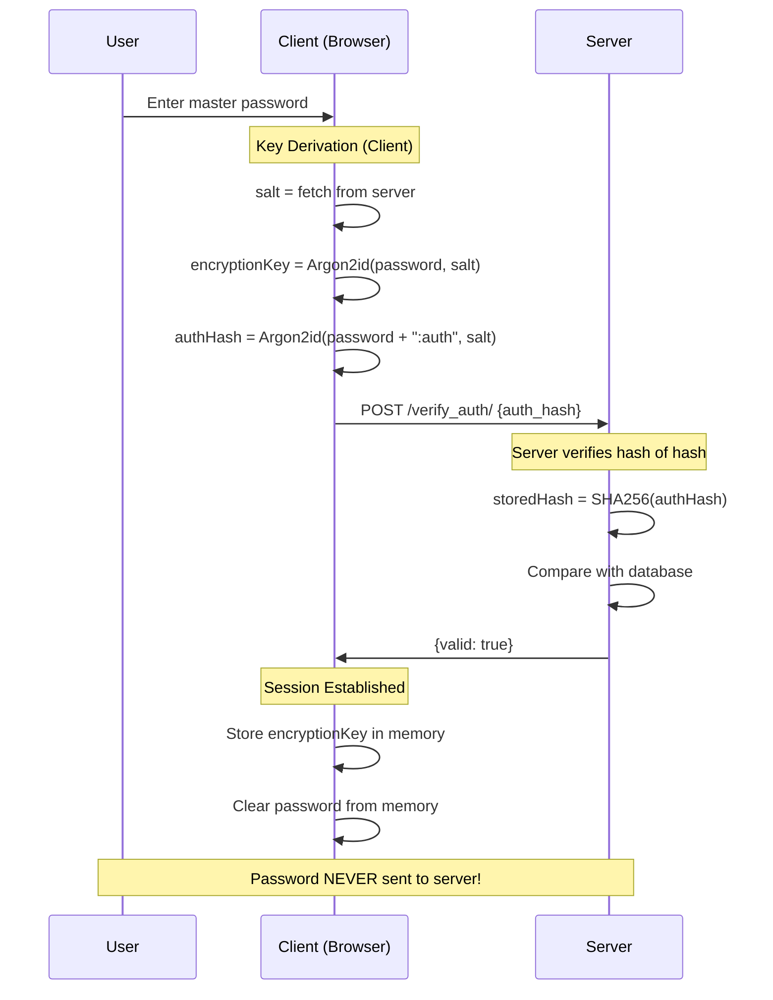
```mermaid
sequenceDiagram
    participant U as User
    participant C as Client (Browser)
    participant S as Server

    U->>C: Enter master password
    
    Note over C: Key Derivation (Client)
    C->>C: salt = fetch from server
    C->>C: encryptionKey = Argon2id(password, salt)
    C->>C: authHash = Argon2id(password + ":auth", salt)
    
    C->>S: POST /verify_auth/ {auth_hash}
    Note over S: Server verifies hash of hash
    S->>S: storedHash = SHA256(authHash)
    S->>S: Compare with database
    S->>C: {valid: true}
    
    Note over C: Session Established
    C->>C: Store encryptionKey in memory
    C->>C: Clear password from memory
    
    Note over U,S: Password NEVER sent to server!
```

---

## 📐 Entity Relationship Diagrams

### Complete Database ER Diagram

```
┌─────────────────────────────────────────────────────────────────────────────────────────────────────────────────┐
│                                    SECUREVAULT DATABASE SCHEMA (ER DIAGRAM)                                      │
├─────────────────────────────────────────────────────────────────────────────────────────────────────────────────┤
│                                                                                                                  │
│  ╔══════════════════════════════════════════════════════════════════════════════════════════════════════════╗   │
│  ║                                         CORE USER & AUTH DOMAIN                                           ║   │
│  ╚══════════════════════════════════════════════════════════════════════════════════════════════════════════╝   │
│                                                                                                                  │
│   ┌────────────────────────┐         ┌────────────────────────┐         ┌────────────────────────┐             │
│   │         User           │         │      TwoFactorAuth     │         │       UserSalt         │             │
│   │  (django.auth.User)    │         │                        │         │                        │             │
│   ├────────────────────────┤         ├────────────────────────┤         ├────────────────────────┤             │
│   │ PK  id            INT  │◄────┐   │ PK  id            INT  │         │ PK  id            INT  │             │
│   │     username      VAR  │     │   │ FK  user_id       INT  │────────►│ FK  user_id       INT  │────────┐    │
│   │     email         VAR  │     │   │     is_enabled    BOOL │         │     salt          BIN  │        │    │
│   │     password      VAR  │     │   │     mfa_type      VAR  │         │     auth_hash     BIN  │        │    │
│   │     first_name    VAR  │     │   │     secret_key    VAR  │         │     created_at    TS   │        │    │
│   │     last_name     VAR  │     │   │     backup_codes  TEXT │         └────────────────────────┘        │    │
│   │     is_active     BOOL │     │   │     authy_id      VAR  │                                            │    │
│   │     date_joined   TS   │     │   │     phone_number  VAR  │                                            │    │
│   │     last_login    TS   │     │   │     last_used     TS   │                                            │    │
│   └─────────┬──────────────┘     │   └────────────────────────┘                                            │    │
│             │                    │                                                                          │    │
│             │                    │   ┌────────────────────────┐         ┌────────────────────────┐         │    │
│             │                    │   │      UserPasskey       │         │      RecoveryKey       │         │    │
│             │                    │   │                        │         │                        │         │    │
│             │                    │   ├────────────────────────┤         ├────────────────────────┤         │    │
│             │                    └───│ FK  user_id       INT  │────────►│ FK  user_id       INT  │─────────┘    │
│             │                        │     credential_id BIN  │ (unique)│     encrypted_vault TEXT│             │
│             │                        │     public_key    BIN  │         │     salt          VAR  │             │
│             │                        │     sign_count    INT  │         │     method        VAR  │             │
│             │                        │     rp_id         VAR  │         │     created_at    TS   │             │
│             │                        │     device_type   VAR  │         └────────────────────────┘             │
│             │                        │     created_at    TS   │                                                 │
│             │                        │     last_used_at  TS   │                                                 │
│             │                        └────────────────────────┘                                                 │
│             │                                                                                                   │
│             │                                                                                                   │
│  ╔══════════╧═══════════════════════════════════════════════════════════════════════════════════════════════╗   │
│  ║                                         VAULT & ENCRYPTION DOMAIN                                          ║   │
│  ╚══════════════════════════════════════════════════════════════════════════════════════════════════════════╝   │
│             │                                                                                                   │
│             │                    ┌────────────────────────────┐                                                 │
│             │                    │       VaultFolder          │                                                 │
│             │                    │                            │                                                 │
│             │                    ├────────────────────────────┤                                                 │
│             ├───────────────────►│ PK  id              INT    │◄─────────┐                                      │
│             │                    │ FK  user_id         INT    │          │                                      │
│             │                    │ FK  parent_id       INT    │──────────┘ (self-ref)                           │
│             │                    │     name            VAR    │                                                 │
│             │                    │     description     TEXT   │                                                 │
│             │                    │     color           VAR    │                                                 │
│             │                    │     icon            VAR    │                                                 │
│             │                    │     created_at      TS     │                                                 │
│             │                    └───────────────┬────────────┘                                                 │
│             │                                    │                                                              │
│             │                                    │                                                              │
│             │    ┌───────────────────────────────┴───────────────────────────────┐                              │
│             │    │                                                               │                              │
│             │    ▼                                                               ▼                              │
│   ┌─────────┴────────────────────┐                             ┌────────────────────────────────────┐          │
│   │    EncryptedVaultItem        │                             │        KyberEncryptedPassword      │          │
│   │                              │                             │                                    │          │
│   ├──────────────────────────────┤                             ├────────────────────────────────────┤          │
│   │ PK  id              UUID     │                             │ PK  id                  UUID       │          │
│   │ FK  user_id         INT      │◄────────────────────────────│ FK  user_id             INT        │          │
│   │ FK  folder_id       INT      │                             │ FK  keypair_id          UUID       │──────┐   │
│   │     item_id         VAR      │ (unique)                    │     service_name        VAR        │      │   │
│   │     item_type       VAR      │                             │     username            VAR        │      │   │
│   │     encrypted_data  TEXT     │ ◄── OPAQUE BLOB             │     url                 URL        │      │   │
│   │     crypto_version  INT      │                             │     kyber_ciphertext    BIN        │ ◄── KEM │
│   │     crypto_metadata JSON     │                             │     aes_ciphertext      BIN        │ ◄── ENC │
│   │     pqc_wrapped_key BIN      │                             │     nonce               BIN        │      │   │
│   │     fhe_password    BIN      │                             │     ephemeral_public_key BIN       │      │   │
│   │     encrypted_domain_hash BIN│                             │     encryption_version  INT        │      │   │
│   │     cached_strength_score BIN│                             │     algorithm           VAR        │      │   │
│   │     tags            JSON     │                             │     is_favorite         BOOL       │      │   │
│   │     favorite        BOOL     │                             │     is_deleted          BOOL       │      │   │
│   │     deleted         BOOL     │                             │     created_at          TS         │      │   │
│   │     created_at      TS       │                             │     last_accessed       TS         │      │   │
│   │     updated_at      TS       │                             └────────────────────────────────────┘      │   │
│   └──────────────────────────────┘                                                                         │   │
│                                                                                                            │   │
│                                                                                                            │   │
│  ╔═══════════════════════════════════════════════════════════════════════════════════════════════════════╗ │   │
│  ║                                    KYBER POST-QUANTUM CRYPTO DOMAIN                                    ║ │   │
│  ╚═══════════════════════════════════════════════════════════════════════════════════════════════════════╝ │   │
│                                                                                                            │   │
│   ┌────────────────────────────────────┐                      ┌────────────────────────────────────┐       │   │
│   │          KyberKeyPair              │                      │          KyberSession              │       │   │
│   │                                    │                      │                                    │       │   │
│   ├────────────────────────────────────┤                      ├────────────────────────────────────┤       │   │
│   │ PK  id                UUID         │◄─────────────────────│ PK  id                UUID         │       │   │
│   │ FK  user_id           INT          │                      │ FK  user_id           INT          │       │   │
│   │     public_key        BIN (1184B)  │                      │ FK  keypair_id        UUID         │───────┘   │
│   │     private_key       BIN (2400B)  │                      │     session_id        VAR          │ (unique)  │
│   │     key_version       INT          │                      │     ciphertext        BIN          │           │
│   │     algorithm         VAR          │                      │     encrypted_shared_secret BIN    │           │
│   │     security_level    INT          │                      │     ip_address        INET         │           │
│   │     is_active         BOOL         │                      │     user_agent        TEXT         │           │
│   │     is_compromised    BOOL         │                      │     is_active         BOOL         │           │
│   │     x25519_public_key BIN (32B)    │                      │     created_at        TS           │           │
│   │     x25519_private_key BIN (32B)   │                      │     expires_at        TS           │           │
│   │     encryption_count  INT          │                      └────────────────────────────────────┘           │
│   │     decryption_count  INT          │                                                                       │
│   │     created_at        TS           │                                                                       │
│   │     last_used         TS           │                                                                       │
│   │     expires_at        TS           │                                                                       │
│   └────────────────────────────────────┘                                                                       │
│                                                                                                                 │
│                                                                                                                 │
│  ╔═══════════════════════════════════════════════════════════════════════════════════════════════════════════╗ │
│  ║                                    BEHAVIORAL RECOVERY DOMAIN                                              ║ │
│  ╚═══════════════════════════════════════════════════════════════════════════════════════════════════════════╝ │
│                                                                                                                 │
│   ┌──────────────────────────────┐        ┌──────────────────────────────┐        ┌─────────────────────────┐  │
│   │   BehavioralCommitment       │        │  BehavioralRecoveryAttempt   │        │   BehavioralChallenge   │  │
│   │                              │        │                              │        │                         │  │
│   ├──────────────────────────────┤        ├──────────────────────────────┤        ├─────────────────────────┤  │
│   │ PK  id              INT      │        │ PK  id              INT      │◄───────│ FK  recovery_attempt_id │  │
│   │ FK  user_id         INT      │        │ FK  user_id         INT      │        │ PK  id              INT │  │
│   │     commitment_id   UUID     │unique  │     attempt_id      UUID     │unique  │     challenge_id    UUID│  │
│   │     encrypted_embedding BIN  │        │     current_stage   VAR      │        │     challenge_type  VAR │  │
│   │     challenge_type  VAR      │        │     samples_collected INT    │        │     challenge_data  JSON│  │
│   │     unlock_conditions JSON   │        │     challenges_completed INT │        │     user_response   JSON│  │
│   │     is_active       BOOL     │        │     similarity_scores JSON   │        │     similarity_score FLT│  │
│   │     samples_used    INT      │        │     overall_similarity FLT   │        │     passed          BOOL│  │
│   │     kyber_public_key BIN     │        │     status          VAR      │        │     attempt_number  INT │  │
│   │     kyber_ciphertext BIN     │        │     ip_address      INET     │        │     created_at      TS  │  │
│   │     is_quantum_protected BOOL│        │     device_fingerprint VAR   │        │     completed_at    TS  │  │
│   │     blockchain_hash VAR      │        │     started_at      TS       │        └─────────────────────────┘  │
│   │     blockchain_anchored BOOL │        │     completed_at    TS       │                                     │
│   │     creation_timestamp TS    │        └──────────────────────────────┘                                     │
│   └──────────────────────────────┘                                                                              │
│                                                                                                                 │
│                                                                                                                 │
│  ╔═══════════════════════════════════════════════════════════════════════════════════════════════════════════╗ │
│  ║                                      FHE & SECURITY DOMAIN                                                 ║ │
│  ╚═══════════════════════════════════════════════════════════════════════════════════════════════════════════╝ │
│                                                                                                                 │
│   ┌──────────────────────────────┐        ┌──────────────────────────────┐        ┌─────────────────────────┐  │
│   │       FHEKeyStore            │        │     FHEComputationCache      │        │     FHEOperationLog     │  │
│   │                              │        │                              │        │                         │  │
│   ├──────────────────────────────┤        ├──────────────────────────────┤        ├─────────────────────────┤  │
│   │ PK  id              UUID     │        │ PK  id              UUID     │        │ PK  id              UUID│  │
│   │ FK  user_id         INT      │        │ FK  user_id         INT      │        │ FK  user_id         INT │  │
│   │     key_type        VAR      │        │     operation_type  VAR      │        │     operation_type  VAR │  │
│   │     encrypted_key_data BIN   │        │     input_hash      VAR      │idx     │     encryption_tier VAR │  │
│   │     key_size_bits   INT      │        │     encrypted_result BIN     │        │     status          VAR │  │
│   │     polynomial_mod_deg INT   │        │     computation_time_ms INT  │        │     total_time_ms   INT │  │
│   │     security_level  INT      │        │     circuit_depth   INT      │        │     cache_hit       BOOL│  │
│   │     is_active       BOOL     │        │     hit_count       INT      │        │     error_message   TEXT│  │
│   │     created_at      TS       │        │     expires_at      TS       │        │     created_at      TS  │  │
│   │     expires_at      TS       │        │     created_at      TS       │        └─────────────────────────┘  │
│   └──────────────────────────────┘        └──────────────────────────────┘                                     │
│                                                                                                                 │
│   ┌──────────────────────────────┐        ┌──────────────────────────────┐        ┌─────────────────────────┐  │
│   │       UserDevice             │        │       LoginAttempt           │        │     SecurityAlert       │  │
│   │                              │        │                              │        │                         │  │
│   ├──────────────────────────────┤        ├──────────────────────────────┤        ├─────────────────────────┤  │
│   │ PK  id              INT      │        │ PK  id              INT      │        │ PK  id              INT │  │
│   │ FK  user_id         INT      │        │ FK  user_id         INT      │        │ FK  user_id         INT │  │
│   │     device_id       UUID     │unique  │ FK  device_id       INT      │        │     alert_type      VAR │  │
│   │     device_name     VAR      │        │     username_attempted VAR   │        │     severity        VAR │  │
│   │     device_type     VAR      │        │     ip_address      INET     │        │     title           VAR │  │
│   │     fingerprint     VAR      │unique  │     status          VAR      │        │     message         TEXT│  │
│   │     browser         VAR      │        │     failure_reason  VAR      │        │     data            JSON│  │
│   │     os              VAR      │        │     is_suspicious   BOOL     │        │     is_read         BOOL│  │
│   │     ip_address      INET     │        │     threat_score    INT      │        │     is_resolved     BOOL│  │
│   │     is_trusted      BOOL     │        │     timestamp       TS       │        │     created_at      TS  │  │
│   │     last_seen       TS       │        └──────────────────────────────┘        └─────────────────────────┘  │
│   └──────────────────────────────┘                                                                              │
│                                                                                                                 │
│                                                                                                                 │
│  ╔═══════════════════════════════════════════════════════════════════════════════════════════════════════════╗ │
│  ║                                       RELATIONSHIPS LEGEND                                                 ║ │
│  ╠═══════════════════════════════════════════════════════════════════════════════════════════════════════════╣ │
│  ║                                                                                                            ║ │
│  ║   ───────►  One-to-Many (FK)     ◄──────►  One-to-One     ────┐    Self-referencing                       ║ │
│  ║                                                            ───┘                                            ║ │
│  ║                                                                                                            ║ │
│  ║   PK = Primary Key    FK = Foreign Key    TS = Timestamp    BIN = Binary    VAR = VARCHAR                 ║ │
│  ║   UUID = UUID type    BOOL = Boolean      INT = Integer     TEXT = Text     JSON = JSON type              ║ │
│  ║                                                                                                            ║ │
│  ╚═══════════════════════════════════════════════════════════════════════════════════════════════════════════╝ │
│                                                                                                                 │
└─────────────────────────────────────────────────────────────────────────────────────────────────────────────────┘
```

### Simplified ER Diagram (Core Relationships)

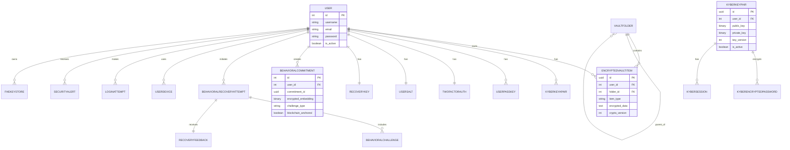
```mermaid
erDiagram
    USER ||--o{ ENCRYPTEDVAULTITEM : owns
    USER ||--o{ KYBERKEYAPAIR : has
    USER ||--o{ USERPASSKEY : has
    USER ||--|| TWOFACTORAUTH : has
    USER ||--|| USERSALT : has
    USER ||--|| RECOVERYKEY : has
    USER ||--o{ BEHAVIORALCOMMITMENT : creates
    USER ||--o{ BEHAVIORALRECOVERYATTEMPT : initiates
    USER ||--o{ USERDEVICE : uses
    USER ||--o{ LOGINATTEMPT : makes
    USER ||--o{ SECURITYALERT : receives
    USER ||--o{ FHEKEYSTORE : owns
    
    VAULTFOLDER ||--o{ ENCRYPTEDVAULTITEM : contains
    VAULTFOLDER ||--o{ VAULTFOLDER : parent_of
    
    KYBERKEYPAIR ||--o{ KYBERENCRYPTEDPASSWORD : encrypts
    KYBERKEYPAIR ||--o{ KYBERSESSION : has
    
    BEHAVIORALRECOVERYATTEMPT ||--o{ BEHAVIORALCHALLENGE : includes
    BEHAVIORALRECOVERYATTEMPT ||--|| RECOVERYFEEDBACK : receives
    
    USER {
        int id PK
        string username
        string email
        string password
        boolean is_active
    }
    
    ENCRYPTEDVAULTITEM {
        uuid id PK
        int user_id FK
        int folder_id FK
        string item_type
        text encrypted_data
        int crypto_version
    }
    
    KYBERKEYPAIR {
        uuid id PK
        int user_id FK
        binary public_key
        binary private_key
        int key_version
        boolean is_active
    }
    
    BEHAVIORALCOMMITMENT {
        int id PK
        int user_id FK
        uuid commitment_id
        binary encrypted_embedding
        string challenge_type
        boolean blockchain_anchored
    }
```

---

## 🔧 Technology Stack

### Backend Technologies

| Technology | Version | Purpose |
|------------|---------|---------|
| Python | 3.13 | Primary language |
| Django | 4.2.16 | Web framework |
| Django REST Framework | 3.14+ | REST API |
| Django Channels | 4.0+ | WebSocket support |
| Celery | 5.3+ | Background tasks |
| Redis | 7.0+ | Cache & message broker |
| PostgreSQL | 15+ | Primary database |
| TensorFlow/Keras | 2.15+ | ML models |
| Transformers | 4.35+ | NLP models |
| Web3.py | 6.0+ | Blockchain interaction |
| Concrete-Python | 2.5+ | Lightweight FHE operations |
| TenSEAL | 0.3.14+ | Batch FHE operations (SEAL) |

### Frontend Technologies

| Technology | Version | Purpose |
|------------|---------|---------|
| React | 18.2.0 | UI framework |
| Vite | 5.0+ | Build tool |
| TensorFlow.js | 4.0+ | Client-side ML |
| @stablelib/x25519 | Latest | X25519 ECDH |
| Argon2-browser | Latest | Client-side KDF |
| CryptoJS | 4.2+ | Cryptographic operations |
| tsparticles | 2.12+ | UI animations |
| React Router | 6.0+ | Client routing |

### DevOps & Infrastructure

| Technology | Purpose |
|------------|---------|
| Docker | Containerization |
| Kubernetes | Orchestration |
| GitHub Actions | CI/CD pipeline |
| Nginx | Reverse proxy & load balancer |
| Gunicorn | WSGI server |
| Daphne | ASGI server (WebSockets) |
| Trivy | Security scanning |

---

## 📁 Project Structure

```
Password_manager/
├── 📁 .github/
│   └── 📁 workflows/
│       └── 📄 ci.yml                    # CI/CD pipeline configuration
├── 📁 contracts/                        # Solidity smart contracts
│   ├── 📁 contracts/
│   │   └── 📄 BehavioralCommitmentAnchor.sol
│   ├── 📁 scripts/                      # Deployment scripts
│   ├── 📁 test/                         # Contract tests
│   ├── 📄 hardhat.config.js             # Hardhat configuration
│   └── 📄 package.json
├── 📁 docker/                           # Docker configurations
│   ├── 📁 backend/
│   │   ├── 📄 Dockerfile                # Backend production image
│   │   └── 📄 entrypoint.sh             # Container entrypoint
│   ├── 📁 frontend/
│   │   ├── 📄 Dockerfile                # Frontend production image
│   │   ├── 📄 Dockerfile.dev            # Frontend development image
│   │   ├── 📄 nginx.conf                # Nginx config for frontend
│   │   └── 📄 entrypoint.sh             # Runtime config injection
│   ├── 📁 nginx/
│   │   └── 📄 nginx.conf                # Main reverse proxy config
│   ├── 📄 docker-compose.yml            # Production compose
│   ├── 📄 docker-compose.dev.yml        # Development compose
│   └── 📄 env.example                   # Environment template
├── 📁 k8s/                              # Kubernetes manifests
│   ├── 📄 namespace.yaml                # K8s namespace
│   ├── 📄 configmap.yaml                # Application config
│   ├── 📄 secrets.yaml                  # Sensitive credentials
│   ├── 📄 deployment.yaml               # All deployments
│   ├── 📄 ingress.yaml                  # Ingress with SSL
│   └── 📄 hpa.yaml                      # Horizontal pod autoscaler
├── 📁 desktop/                          # Electron desktop app
│   ├── 📄 main.js                       # Electron main process
│   ├── 📁 src/                          # Desktop source code
│   └── 📄 package.json
├── 📁 mobile/                           # React Native mobile app
│   ├── 📄 App.js                        # Mobile entry point
│   ├── 📁 src/                          # Mobile source code
│   └── 📄 package.json
├── 📁 browser-extension/                # Browser extension
│   ├── 📄 manifest.json                 # Extension manifest
│   ├── 📁 src/                          # Extension source code
│   └── 📄 package.json
├── 📁 frontend/                         # React web application
│   ├── 📁 src/
│   │   ├── 📁 Components/               # React components
│   │   │   ├── 📁 auth/                 # Authentication components
│   │   │   ├── 📁 animations/           # UI animations
│   │   │   ├── 📁 recovery/             # Recovery flow components
│   │   │   └── 📁 sharedfolders/        # Shared folders UI
│   │   ├── 📁 services/                 # Frontend services
│   │   │   ├── 📄 api.js                # API client
│   │   │   ├── 📄 cryptoService.js      # Client-side encryption
│   │   │   ├── 📄 xchachaEncryption.js  # XChaCha20 encryption
│   │   │   ├── 📄 eccService.js         # ECC operations
│   │   │   ├── 📁 quantum/              # Post-quantum crypto
│   │   │   │   └── 📄 kyberService.js   # Kyber-768 implementation
│   │   │   ├── 📁 fhe/                  # Fully Homomorphic Encryption
│   │   │   │   ├── 📄 fheService.js     # FHE client service (WASM)
│   │   │   │   ├── 📄 fheKeys.js        # FHE key management (IndexedDB)
│   │   │   │   └── 📄 index.js          # FHE module exports
│   │   │   ├── 📁 behavioralCapture/    # Behavioral biometrics
│   │   │   └── 📁 blockchain/           # Web3 integration
│   │   ├── 📁 ml/                       # Client-side ML
│   │   │   └── 📁 behavioralDNA/        # Behavioral DNA models
│   │   ├── 📁 contexts/                 # React contexts
│   │   ├── 📁 hooks/                    # Custom hooks
│   │   └── 📁 utils/                    # Utility functions
│   ├── 📄 vite.config.js                # Vite configuration
│   └── 📄 package.json
├── 📁 password_manager/                 # Django backend
│   ├── 📁 password_manager/             # Django project settings
│   │   ├── 📄 settings.py               # Main settings
│   │   ├── 📄 urls.py                   # Root URL config
│   │   ├── 📄 asgi.py                   # ASGI config
│   │   ├── 📄 wsgi.py                   # WSGI config
│   │   └── 📄 throttling.py             # Rate limiting
│   ├── 📁 api/                          # API app
│   │   ├── 📄 health.py                 # Health check endpoints
│   │   └── 📄 urls.py                   # API URL routing
│   ├── 📁 auth_module/                  # Authentication
│   │   ├── 📄 views.py                  # Auth views
│   │   ├── 📄 passkey_views.py          # WebAuthn endpoints
│   │   ├── 📄 oauth_views.py            # OAuth endpoints
│   │   ├── 📄 mfa_views.py              # MFA endpoints
│   │   ├── 📄 passkey_primary_recovery_views.py  # Primary recovery
│   │   ├── 📄 quantum_recovery_views.py # Quantum recovery
│   │   └── 📁 services/                 # Auth services
│   │       ├── 📄 quantum_crypto_service.py
│   │       ├── 📄 kyber_crypto.py
│   │       └── 📄 passkey_primary_recovery_service.py
│   ├── 📁 vault/                        # Vault management
│   │   ├── 📁 views/                    # Vault views
│   │   └── 📄 urls.py                   # Vault URLs
│   ├── 📁 security/                     # Security features
│   │   ├── 📄 views.py                  # Security endpoints
│   │   └── 📁 api/                      # Security APIs
│   ├── 📁 ml_security/                  # ML security models
│   │   ├── 📄 views.py                  # ML endpoints
│   │   └── 📁 ml_models/                # Trained models
│   ├── 📁 ml_dark_web/                  # Dark web monitoring
│   │   ├── 📁 ml_services.py            # ML services
│   │   └── 📄 routing.py                # WebSocket routing
│   ├── 📁 behavioral_recovery/          # Behavioral recovery
│   │   ├── 📄 views.py                  # Recovery endpoints
│   │   ├── 📄 models.py                 # Recovery models
│   │   └── 📁 services/                 # Recovery services
│   ├── 📁 blockchain/                   # Blockchain integration
│   │   ├── 📄 views.py                  # Blockchain endpoints
│   │   └── 📁 services/                 # Blockchain services
│   ├── 📁 fhe_service/                  # FHE (Fully Homomorphic Encryption)
│   │   ├── 📄 views.py                  # FHE API endpoints
│   │   ├── 📄 models.py                 # FHE models (cache, keystore, logs)
│   │   ├── 📄 urls.py                   # FHE URL routing
│   │   └── 📁 services/                 # FHE services
│   │       ├── 📄 concrete_service.py   # Concrete-Python operations
│   │       ├── 📄 seal_service.py       # TenSEAL batch operations
│   │       ├── 📄 fhe_router.py         # Intelligent operation routing
│   │       ├── 📄 fhe_cache.py          # Redis computation cache
│   │       └── 📄 adaptive_manager.py   # Circuit depth management
│   ├── 📁 shared/                       # Shared utilities
│   │   ├── 📄 performance_views.py      # Performance monitoring
│   │   └── 📁 crypto/                   # Server crypto utilities
│   ├── 📁 analytics/                    # Analytics
│   ├── 📁 ab_testing/                   # A/B testing
│   ├── 📁 email_masking/                # Email alias service
│   └── 📄 requirements.txt              # Python dependencies
├── 📁 tests/                            # Test suite
│   ├── 📁 behavioral_recovery/
│   ├── 📁 functional/
│   └── 📄 run_all_tests.py
├── 📁 scripts/                          # Utility scripts
├── 📁 docs/                             # Documentation
└── 📄 README.md                         # This file
```

---

## 📂 Detailed Project Files Structure

### Complete Backend Structure (`password_manager/`)

```
password_manager/
├── 📁 password_manager/                    # Django Project Settings
│   ├── 📄 settings.py                      # Main settings (965 lines)
│   │   ├── DATABASES                       # PostgreSQL configuration
│   │   ├── CACHES                          # Redis cache backend
│   │   ├── CELERY_*                        # Celery configuration
│   │   ├── REST_FRAMEWORK                  # DRF settings
│   │   ├── SIMPLE_JWT                      # JWT token settings
│   │   ├── CORS_*                          # CORS configuration
│   │   └── CHANNEL_LAYERS                  # Django Channels config
│   ├── 📄 urls.py                          # Root URL routing (113 lines)
│   ├── 📄 asgi.py                          # ASGI config for WebSockets
│   ├── 📄 wsgi.py                          # WSGI config for Gunicorn
│   ├── 📄 compression_middleware.py        # Gzip/Brotli compression (320 lines)
│   │   ├── VaultCompressionMiddleware      # Response compression
│   │   ├── SecurityHeadersMiddleware       # CSP, HSTS headers
│   │   └── CacheControlMiddleware          # Cache headers
│   ├── 📄 throttling.py                    # Rate limiting (154 lines)
│   └── 📄 api_utils.py                     # API response utilities
│
├── 📁 auth_module/                         # Authentication Module
│   ├── 📄 views.py                         # Core auth endpoints (1403 lines)
│   │   ├── RegisterView                    # User registration
│   │   ├── LoginView                       # User login
│   │   └── LogoutView                      # User logout
│   ├── 📄 passkey_views.py                 # WebAuthn/FIDO2 (587 lines)
│   │   ├── PasskeyRegistrationView         # Register passkey
│   │   ├── PasskeyAuthenticationView       # Authenticate with passkey
│   │   └── PasskeyListView                 # List user's passkeys
│   ├── 📄 mfa_views.py                     # Multi-factor auth (790 lines)
│   │   ├── TOTPSetupView                   # TOTP setup
│   │   ├── BiometricSetupView              # Biometric enrollment
│   │   └── MFAVerifyView                   # Verify MFA code
│   ├── 📄 oauth_views.py                   # OAuth 2.0 (427 lines)
│   │   ├── GoogleOAuthView                 # Google login
│   │   ├── GitHubOAuthView                 # GitHub login
│   │   └── AppleOAuthView                  # Apple login
│   ├── 📄 kyber_views.py                   # Kyber API (async views)
│   │   ├── generate_keypair                # Async keypair generation
│   │   ├── encrypt_password                # Hybrid encryption
│   │   ├── decrypt_password                # Hybrid decryption
│   │   ├── batch_encrypt                   # Batch operations
│   │   └── get_kyber_metrics               # Performance metrics
│   ├── 📄 passkey_primary_recovery_views.py # Primary recovery (637 lines)
│   ├── 📄 quantum_recovery_views.py        # Social mesh recovery (1104 lines)
│   ├── 📄 models.py                        # Auth models (540 lines)
│   │   ├── KyberKeyPair                    # Kyber-768 keypairs
│   │   ├── KyberEncryptedPassword          # Kyber-encrypted data
│   │   ├── KyberSession                    # Session shared secrets
│   │   ├── TwoFactorAuth                   # 2FA settings
│   │   ├── UserSalt                        # User's key derivation salt
│   │   ├── UserPasskey                     # WebAuthn credentials
│   │   ├── RecoveryKey                     # Recovery key backup
│   │   └── PushAuth                        # Push notification auth
│   └── 📁 services/                        # Auth services
│       ├── 📄 kyber_crypto.py              # Kyber-768 implementation
│       ├── 📄 optimized_ntt.py             # NumPy-optimized NTT
│       │   ├── OptimizedNTT                # Main NTT class
│       │   ├── forward_ntt()               # Forward transform
│       │   ├── inverse_ntt()               # Inverse transform
│       │   └── multiply_ntt()              # Pointwise multiply
│       ├── 📄 parallel_kyber.py            # Parallel operations
│       │   └── ParallelKyberOperations     # ThreadPoolExecutor batch ops
│       ├── 📄 kyber_cache.py               # Hybrid caching (959 lines)
│       │   ├── L1: Memory (LRU)            # Hot keys
│       │   ├── L2: Redis                   # Distributed cache
│       │   └── L3: Database                # Persistent storage
│       ├── 📄 kyber_monitor.py             # Performance monitoring
│       ├── 📄 quantum_crypto_service.py    # PQC service
│       ├── 📄 passkey_primary_recovery_service.py
│       ├── 📄 challenge_generator.py       # Temporal challenges
│       └── 📄 trust_scorer.py              # Trust scoring algorithm
│
├── 📁 vault/                               # Vault Management
│   ├── 📁 views/
│   │   ├── 📄 crud_views.py                # Basic CRUD operations
│   │   ├── 📄 api_views.py                 # Enhanced API (309 lines)
│   │   │   ├── get_salt                    # User salt for KDF
│   │   │   ├── verify_auth                 # Zero-knowledge auth
│   │   │   └── statistics                  # Cached vault stats
│   │   ├── 📄 backup_views.py              # Backup/restore
│   │   ├── 📄 folder_views.py              # Folder management
│   │   └── 📄 shared_folder_views.py       # Shared folders (RBAC)
│   ├── 📁 models/
│   │   ├── 📄 vault_models.py              # EncryptedVaultItem
│   │   └── 📄 folder_models.py             # VaultFolder
│   ├── 📁 services/
│   │   ├── 📄 vault_optimization_service.py # Optimization (483 lines)
│   │   │   ├── VaultCacheManager           # Multi-level caching
│   │   │   ├── VaultQueryOptimizer         # Query optimization
│   │   │   ├── VaultCompression            # Gzip utilities
│   │   │   └── AuthHashService             # Zero-knowledge auth
│   │   └── 📄 __init__.py
│   └── 📄 tasks.py                         # Celery tasks (471 lines)
│       ├── process_audit_log               # Async audit logging
│       ├── warm_user_cache                 # Cache warming
│       ├── cleanup_deleted_items           # Purge soft-deleted
│       ├── check_breach_status             # HIBP API check
│       └── prepare_export                  # Encrypted export
│
├── 📁 fhe_service/                         # Fully Homomorphic Encryption
│   ├── 📄 views.py                         # FHE endpoints (663 lines)
│   │   ├── fhe_encrypt                     # Encrypt with FHE
│   │   ├── fhe_strength_check              # Password strength
│   │   ├── fhe_batch_strength              # Batch evaluation
│   │   └── fhe_search                      # Encrypted search
│   ├── 📄 models.py                        # FHE models (287 lines)
│   │   ├── FHEKeyStore                     # User FHE keys
│   │   ├── FHEComputationCacheModel        # Computation cache
│   │   ├── FHEOperationLog                 # Audit log
│   │   └── FHEMetrics                      # Aggregated metrics
│   └── 📁 services/
│       ├── 📄 concrete_service.py          # Concrete-Python ops
│       ├── 📄 seal_service.py              # TenSEAL SEAL ops
│       ├── 📄 fhe_router.py                # Tier routing
│       ├── 📄 fhe_cache.py                 # Redis cache
│       └── 📄 adaptive_manager.py          # Depth management
│
├── 📁 behavioral_recovery/                 # Behavioral Recovery System
│   ├── 📄 views.py                         # Recovery endpoints (726 lines)
│   ├── 📄 models.py                        # Recovery models (587 lines)
│   │   ├── BehavioralCommitment            # 247-dim DNA storage
│   │   ├── BehavioralRecoveryAttempt       # Recovery attempts
│   │   ├── BehavioralChallenge             # Individual challenges
│   │   ├── BehavioralProfileSnapshot       # Periodic snapshots
│   │   ├── RecoveryFeedback                # User feedback (Phase 2B.2)
│   │   └── RecoveryPerformanceMetric       # Performance metrics
│   ├── 📄 tasks.py                         # Celery tasks
│   └── 📁 services/
│       ├── 📄 recovery_orchestrator.py     # Flow orchestration
│       ├── 📄 behavioral_analyzer.py       # DNA analysis
│       └── 📄 guardian_service.py          # Guardian mesh
│
├── 📁 blockchain/                          # Blockchain Anchoring
│   ├── 📄 views.py                         # Blockchain endpoints (390 lines)
│   ├── 📄 models.py                        # Anchor models
│   └── 📁 services/
│       ├── 📄 blockchain_anchor_service.py # Web3.py + Merkle trees
│       ├── 📄 merkle_tree.py               # Merkle tree implementation
│       └── 📄 commitment_hasher.py         # SHA-256 hashing
│
├── 📁 ml_security/                         # Machine Learning Security
│   ├── 📄 views.py                         # ML endpoints
│   └── 📁 ml_models/
│       ├── 📄 password_strength_model.py   # LSTM password strength
│       ├── 📄 anomaly_detector.py          # Isolation Forest
│       ├── 📄 threat_analyzer.py           # CNN-LSTM threat analysis
│       └── 📄 behavioral_model.py          # Behavioral profiling
│
├── 📁 ml_dark_web/                         # Dark Web Monitoring
│   ├── 📄 ml_services.py                   # BERT breach detection
│   ├── 📄 consumers.py                     # WebSocket consumers
│   └── 📄 routing.py                       # WebSocket routing
│
├── 📁 security/                            # Security Features
│   ├── 📄 views.py                         # Security endpoints
│   ├── 📄 models.py                        # Security models (207 lines)
│   │   ├── UserDevice                      # Device tracking
│   │   ├── SocialMediaAccount              # Social account protection
│   │   ├── LoginAttempt                    # Login tracking
│   │   ├── SecurityAlert                   # Alert system
│   │   ├── UserNotificationSettings        # Notification prefs
│   │   └── AccountLockEvent                # Lock/unlock events
│   └── 📁 services/
│       ├── 📄 breach_monitor.py            # Breach monitoring
│       └── 📄 device_trust.py              # Device trust scoring
│
└── 📄 requirements.txt                     # 119 Python packages
```

### Complete Frontend Structure (`frontend/src/`)

```
frontend/src/
├── 📄 App.jsx                              # Main React app (1149 lines)
├── 📄 App.css                              # Global styles (638 lines)
├── 📄 main.jsx                             # React entry point
│
├── 📁 services/                            # Frontend Services
│   ├── 📄 api.js                           # API client (209 lines)
│   ├── 📄 cryptoService.js                 # AES-GCM encryption (454 lines)
│   ├── 📄 secureVaultCrypto.js             # WebCrypto API (717 lines) ⭐
│   │   ├── deriveKeyFromPassword()         # Argon2id KDF
│   │   ├── encrypt()                       # AES-256-GCM encrypt
│   │   ├── decrypt()                       # AES-256-GCM decrypt
│   │   ├── generatePassword()              # Secure random generator
│   │   └── clearMemory()                   # Secure memory wipe
│   ├── 📄 secureVaultService.js            # Zero-knowledge ops (709 lines) ⭐
│   │   ├── initialize()                    # Init with master password
│   │   ├── fetchAndDecryptItems()          # Fetch + decrypt
│   │   ├── encryptAndSave()                # Encrypt + save
│   │   └── verifyMasterPassword()          # Zero-knowledge verify
│   ├── 📄 xchachaEncryption.js             # XChaCha20-Poly1305 (413 lines)
│   ├── 📄 eccService.js                    # ECC operations (367 lines)
│   ├── 📁 quantum/
│   │   ├── 📄 kyberService.js              # Kyber-768 + X25519 (1232 lines)
│   │   │   ├── generateKeypair()           # Hybrid keypair gen
│   │   │   ├── hybridEncapsulate()         # KEM + DH
│   │   │   └── hybridDecapsulate()         # Decapsulation
│   │   └── 📄 index.js                     # Quantum exports
│   ├── 📁 fhe/
│   │   ├── 📄 fheService.js                # TFHE WASM client (681 lines)
│   │   │   ├── initialize()                # Load WASM module
│   │   │   ├── generateKeys()              # FHE keypair gen
│   │   │   ├── encryptPassword()           # FHE encrypt
│   │   │   └── checkStrength()             # Encrypted strength
│   │   ├── 📄 fheKeys.js                   # IndexedDB key storage (604 lines)
│   │   └── 📄 index.js
│   ├── 📁 behavioralCapture/
│   │   ├── 📄 BehavioralCaptureEngine.js   # 247-dim capture
│   │   ├── 📄 KeystrokeDynamics.js         # Typing patterns
│   │   ├── 📄 MouseBiometrics.js           # Mouse patterns
│   │   └── 📄 CognitivePatterns.js         # Cognitive analysis
│   ├── 📁 blockchain/
│   │   ├── 📄 web3Service.js               # Web3 integration
│   │   └── 📄 contractABI.json             # Smart contract ABI
│   ├── 📄 vaultService.js                  # Vault operations (438 lines)
│   ├── 📄 mfaService.js                    # MFA client (583 lines)
│   ├── 📄 oauthService.js                  # OAuth client (235 lines)
│   ├── 📄 mlSecurityService.js             # ML security (369 lines)
│   ├── 📄 darkWebService.js                # Dark web monitoring (115 lines)
│   ├── 📄 analyticsService.js              # Analytics (734 lines)
│   ├── 📄 preferencesService.js            # User preferences (809 lines)
│   ├── 📄 performanceMonitor.js            # Performance tracking (528 lines)
│   └── 📄 SecureBehavioralStorage.js       # Encrypted IndexedDB (373 lines)
│
├── 📁 hooks/                               # React Hooks
│   ├── 📄 useAuth.jsx                      # Authentication hook
│   ├── 📄 useSecureVault.js                # Vault operations (466 lines) ⭐
│   │   ├── initialize()                    # Init vault
│   │   ├── fetchItems()                    # Fetch + decrypt
│   │   ├── saveItem()                      # Encrypt + save
│   │   └── deleteItem()                    # Soft delete
│   ├── 📄 useKyber.js                      # Kyber WASM/Worker
│   ├── 📄 useBehavioralRecovery.js         # Recovery hook
│   ├── 📄 useBiometricReauth.js            # Biometric re-auth
│   ├── 📄 useBreachWebSocket.js            # Breach alerts
│   └── 📄 useSecureSession.js              # Session management
│
├── 📁 contexts/                            # React Contexts
│   ├── 📄 AuthContext.jsx                  # Authentication state
│   ├── 📄 VaultContext.jsx                 # Vault state
│   ├── 📄 BehavioralContext.jsx            # Behavioral profile
│   └── 📄 AccessibilityContext.jsx         # A11y settings
│
├── 📁 Components/
│   ├── 📁 auth/                            # Auth Components
│   │   ├── 📄 Login.jsx                    # Login form (174 lines)
│   │   ├── 📄 PasskeyAuth.jsx              # Passkey auth (308 lines)
│   │   ├── 📄 PasskeyRegistration.jsx      # Passkey setup (179 lines)
│   │   ├── 📄 BiometricAuth.jsx            # Biometric auth (413 lines)
│   │   ├── 📄 BiometricSetup.jsx           # Biometric enrollment (437 lines)
│   │   ├── 📄 TwoFactorSetup.jsx           # 2FA config (417 lines)
│   │   ├── 📄 RecoveryKeySetup.jsx         # Recovery key (434 lines)
│   │   ├── 📄 PasswordRecovery.jsx         # Password recovery (636 lines)
│   │   ├── 📄 PasskeyPrimaryRecoverySetup.jsx # Primary recovery (451 lines)
│   │   ├── 📄 PasskeyPrimaryRecoveryInitiate.jsx # Recovery start (517 lines)
│   │   ├── 📄 QuantumRecoverySetup.jsx     # Quantum recovery UI (696 lines)
│   │   ├── 📄 OAuthCallback.jsx            # OAuth callback (334 lines)
│   │   └── 📄 SocialLoginButtons.jsx       # Social login (98 lines)
│   │
│   ├── 📁 vault/                           # Vault Components
│   │   ├── 📄 VaultList.jsx                # Item list
│   │   ├── 📄 VaultItem.jsx                # Item display
│   │   ├── 📄 VaultItemDetail.jsx          # Item detail
│   │   └── 📄 VaultSearch.jsx              # Search functionality
│   │
│   ├── 📁 security/                        # Security Components
│   │   ├── 📄 PasswordGenerator.jsx        # Password generator
│   │   ├── 📄 PasswordStrengthMeter.jsx    # Strength meter
│   │   ├── 📄 PasswordStrengthMeterML.jsx  # ML-powered strength
│   │   ├── 📄 SessionMonitor.jsx           # Session monitoring
│   │   ├── 📄 AccountProtection.jsx        # Account protection
│   │   └── 📄 BiometricReauth.jsx          # Re-authentication
│   │
│   ├── 📁 sharedfolders/                   # Shared Folders
│   │   ├── 📄 SharedFoldersDashboard.jsx   # Dashboard (376 lines)
│   │   ├── 📄 CreateFolderModal.jsx        # Create folder (368 lines)
│   │   ├── 📄 FolderDetailsModal.jsx       # Folder details (590 lines)
│   │   └── 📄 InvitationsModal.jsx         # Invitations (427 lines)
│   │
│   ├── 📁 recovery/                        # Recovery Components
│   │   ├── 📁 behavioral/
│   │   │   ├── 📄 BehavioralRecoveryFlow.jsx
│   │   │   └── 📄 ChallengeDisplay.jsx
│   │   └── 📁 social/
│   │       └── 📄 SocialMeshRecovery.jsx
│   │
│   ├── 📁 admin/                           # Admin Components
│   │   ├── 📄 RecoveryDashboard.jsx        # Recovery admin
│   │   └── 📄 PerformanceMonitoring.jsx    # Performance admin
│   │
│   └── 📁 common/                          # Common Components
│       ├── 📄 Button.jsx
│       ├── 📄 Modal.jsx
│       ├── 📄 Input.jsx
│       ├── 📄 LoadingIndicator.jsx
│       └── 📄 ErrorBoundary.jsx
│
├── 📁 ml/                                  # Client-side ML
│   └── 📁 behavioralDNA/
│       ├── 📄 index.js                     # ML exports
│       ├── 📄 HybridModel.js               # Client/server switcher
│       ├── 📄 TransformerModel.js          # Behavioral transformer
│       └── 📄 BackendAPI.js                # Backend ML API client
│
├── 📁 utils/                               # Utilities
│   ├── 📄 kyber-wasm-loader.js             # Kyber WASM loader
│   ├── 📄 kyber-cache.js                   # IndexedDB cache
│   ├── 📄 deviceFingerprint.js             # Device fingerprinting
│   ├── 📄 errorHandler.js                  # Error handling
│   ├── 📄 NetworkQualityEstimator.js       # Network quality
│   └── 📄 OfflineQueueManager.js           # Offline queue
│
└── 📁 workers/                             # Web Workers
    └── 📄 kyber-worker.js                  # Background Kyber ops
```

### Docker & DevOps Structure

```
docker/
├── 📄 docker-compose.yml                   # Production compose (362 lines)
│   ├── backend                             # Django + Gunicorn
│   ├── frontend                            # Nginx + React
│   ├── postgres                            # PostgreSQL 15
│   ├── redis                               # Redis 7
│   ├── celery-worker                       # Celery workers
│   ├── celery-beat                         # Celery scheduler
│   └── daphne                              # WebSocket server
├── 📄 docker-compose.dev.yml               # Development compose
├── 📄 env.example                          # Environment template
├── 📁 backend/
│   ├── 📄 Dockerfile                       # Multi-stage build
│   └── 📄 entrypoint.sh                    # Migrations + startup
├── 📁 frontend/
│   ├── 📄 Dockerfile                       # Production build
│   ├── 📄 Dockerfile.dev                   # Development build
│   ├── 📄 nginx.conf                       # Nginx configuration
│   └── 📄 entrypoint.sh                    # Runtime env injection
└── 📁 nginx/
    └── 📄 nginx.conf                       # Reverse proxy config

k8s/
├── 📄 namespace.yaml                       # password-manager namespace
├── 📄 configmap.yaml                       # Application config
├── 📄 secrets.yaml                         # Sensitive credentials
├── 📄 deployment.yaml                      # All deployments (697 lines)
│   ├── backend-deployment                  # Django (replicas: 4)
│   ├── frontend-deployment                 # Nginx (replicas: 3)
│   ├── celery-worker-deployment            # Workers (replicas: 2)
│   ├── celery-beat-deployment              # Scheduler (replicas: 1)
│   └── daphne-deployment                   # WebSocket (replicas: 2)
├── 📄 ingress.yaml                         # nginx-ingress + SSL
└── 📄 hpa.yaml                             # Horizontal pod autoscalers

.github/workflows/
└── 📄 ci.yml                               # CI/CD pipeline (536 lines)
    ├── test                                # pytest + vitest
    ├── lint                                # flake8 + ESLint
    ├── security                            # bandit + safety + Trivy
    ├── build                               # Docker multi-arch
    ├── deploy-staging                      # Auto on develop
    └── deploy-production                   # Manual approval
```

---

## 🚀 Quick Start

### Prerequisites

- Python 3.13+
- Node.js 20+
- PostgreSQL 15+
- Redis 7+
- Docker & Docker Compose (optional)

### Option 1: Docker Compose (Recommended)

```bash
# Clone repository
git clone https://github.com/yourusername/Password_manager.git
cd Password_manager

# Copy environment file
cp docker/env.example docker/.env

# Edit .env with your settings
nano docker/.env

# Start all services
cd docker
docker-compose up -d

# Access the application
# Frontend: http://localhost:3000
# Backend API: http://localhost:8000
# API Docs: http://localhost:8000/docs/
```

### Option 2: Manual Setup

```bash
# Backend Setup
cd password_manager
python -m venv venv
source venv/bin/activate  # Windows: venv\Scripts\activate
pip install -r requirements.txt

# Create .env file (IMPORTANT!)
cp env.example .env
# Edit .env and ensure DEBUG=True for development

python manage.py migrate
python manage.py runserver 8000

# Frontend Setup (new terminal)
cd frontend
npm install
npm run dev

# Access at http://localhost:5173
```

### ⚠️ Important Development Notes

| Setting | Development | Production |
|---------|-------------|------------|
| `DEBUG` | `True` | `False` |
| Rate Limiting (auth) | 30/minute | 3/minute |
| HTTPS Redirect | Disabled | Enabled |
| Error Details | Shown | Hidden |

**Common Issues & Solutions:**

1. **HTTPS Redirect Loops / SSL Errors**
   - Ensure `DEBUG=True` in `password_manager/.env`
   - This disables `SECURE_SSL_REDIRECT` which causes issues in development

2. **HTTP 429 Too Many Requests**
   - Rate limiting is automatically lenient in `DEBUG` mode
   - If hitting limits, restart the backend server

3. **WebSocket / ASGI Errors**
   - Use `python manage.py runserver` (WSGI) for development
   - Daphne (ASGI) is only needed for WebSocket features in production

4. **Login Form Not Submitting**
   - Clear browser cache and localStorage
   - Ensure both email and password fields are filled

### Test User Setup

```bash
# Create a test user for development
cd password_manager
python manage.py shell -c "
from django.contrib.auth.models import User
from auth_module.models import UserSalt
import os
u, _ = User.objects.get_or_create(username='testuser@gmail.com', defaults={'email': 'testuser@gmail.com'})
u.set_password('TestPass123!')
u.save()
if not UserSalt.objects.filter(user=u).exists():
    UserSalt.objects.create(user=u, salt=os.urandom(32), auth_hash=os.urandom(64))
print('Test user created: testuser@gmail.com / TestPass123!')
"
```

---

## 🔐 Encryption & Decryption Mechanisms

### Zero-Knowledge Architecture

SecureVault implements a **strict zero-knowledge architecture** where:

1. **All encryption/decryption happens client-side**
2. **Server never receives plaintext data or encryption keys**
3. **Master password never leaves the client**
4. **Only encrypted blobs are transmitted and stored**

### Encryption Flow Diagram

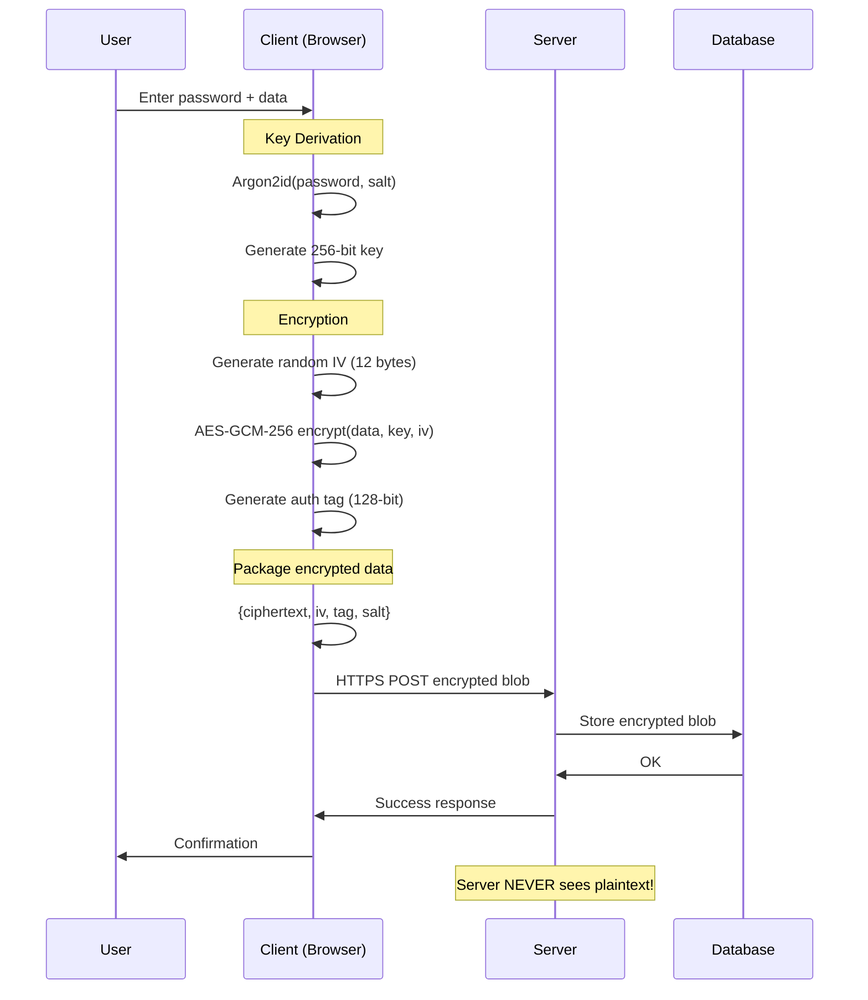
```mermaid
sequenceDiagram
    participant U as User
    participant C as Client (Browser)
    participant S as Server
    participant DB as Database

    U->>C: Enter password + data
    
    Note over C: Key Derivation
    C->>C: Argon2id(password, salt)
    C->>C: Generate 256-bit key
    
    Note over C: Encryption
    C->>C: Generate random IV (12 bytes)
    C->>C: AES-GCM-256 encrypt(data, key, iv)
    C->>C: Generate auth tag (128-bit)
    
    Note over C: Package encrypted data
    C->>C: {ciphertext, iv, tag, salt}
    
    C->>S: HTTPS POST encrypted blob
    S->>DB: Store encrypted blob
    DB->>S: OK
    S->>C: Success response
    C->>U: Confirmation
    
    Note over S: Server NEVER sees plaintext!
```

### Encryption Algorithms Supported

#### 1. AES-GCM-256 (Primary)

```javascript
// Client-side implementation (cryptoService.js)
async encrypt(data, salt) {
  // Derive key using Argon2id
  const key = await this.deriveKey(salt);
  
  // Generate random IV
  const iv = crypto.getRandomValues(new Uint8Array(12));
  
  // Encrypt with AES-GCM
  const encrypted = await crypto.subtle.encrypt(
    { name: 'AES-GCM', iv, tagLength: 128 },
    key,
    new TextEncoder().encode(JSON.stringify(data))
  );
  
  return { ciphertext: encrypted, iv, salt };
}
```

#### 2. XChaCha20-Poly1305 (Alternative)

```javascript
// Client-side implementation (xchachaEncryption.js)
async encrypt(keyBuffer, plaintext, associatedData) {
  const nonce = crypto.getRandomValues(new Uint8Array(24)); // Extended nonce
  const ciphertext = await xchacha20poly1305(keyBuffer, nonce, plaintext);
  return { ciphertext, nonce, aad: associatedData };
}
```

#### 3. CRYSTALS-Kyber-768 (Post-Quantum)

```javascript
// Client-side implementation (kyberService.js)
async hybridEncapsulate(recipientPublicKey) {
  // Kyber-768 encapsulation
  const { ciphertext: kyberCt, sharedSecret: kyberSs } = 
    await this.kyberEncapsulate(recipientPublicKey.kyber);
  
  // X25519 key agreement
  const { publicKey: x25519Pk, sharedSecret: x25519Ss } = 
    await this.x25519KeyAgreement(recipientPublicKey.x25519);
  
  // Combine shared secrets
  const combinedSecret = await this.combineSecrets(kyberSs, x25519Ss);
  
  return { 
    ciphertext: { kyber: kyberCt, x25519: x25519Pk },
    sharedSecret: combinedSecret 
  };
}
```

### Key Derivation Function (Argon2id)

```
┌─────────────────────────────────────────────────────────────┐
│                    ARGON2ID KEY DERIVATION                   │
└─────────────────────────────────────────────────────────────┘

    Master Password              User-Specific Salt
           │                           │
           └───────────┬───────────────┘
                       │
                       ▼
        ┌─────────────────────────────┐
        │         ARGON2ID            │
        │                             │
        │  Memory:      64 MB         │
        │  Iterations:  3             │
        │  Parallelism: 4             │
        │  Hash Length: 32 bytes      │
        │  Salt Length: 16 bytes      │
        │                             │
        │  Version: 0x13 (v1.3)       │
        │  Type: Argon2id (hybrid)    │
        └─────────────┬───────────────┘
                      │
                      ▼
        ┌─────────────────────────────┐
        │   256-bit Encryption Key    │
        │   (Used for AES-GCM-256)    │
        └─────────────────────────────┘
```

### Decryption Flow

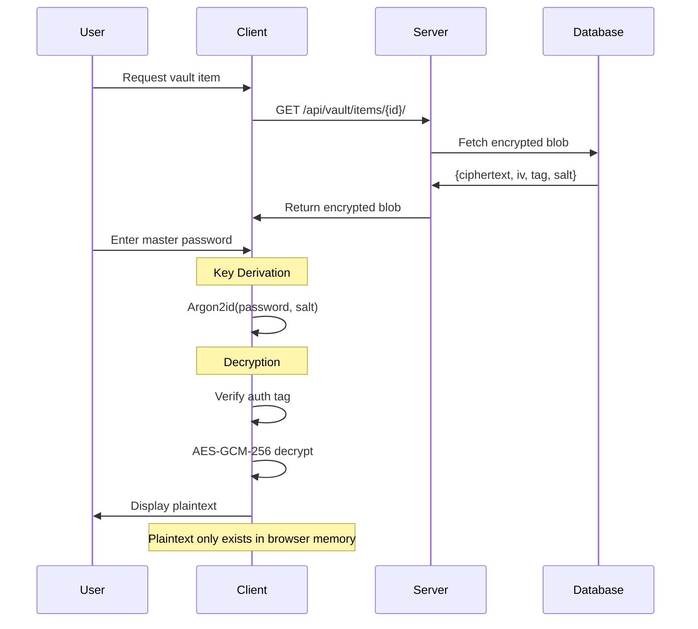
```mermaid
sequenceDiagram
    participant U as User
    participant C as Client
    participant S as Server
    participant DB as Database

    U->>C: Request vault item
    C->>S: GET /api/vault/items/{id}/
    S->>DB: Fetch encrypted blob
    DB->>S: {ciphertext, iv, tag, salt}
    S->>C: Return encrypted blob
    
    U->>C: Enter master password
    
    Note over C: Key Derivation
    C->>C: Argon2id(password, salt)
    
    Note over C: Decryption
    C->>C: Verify auth tag
    C->>C: AES-GCM-256 decrypt
    
    C->>U: Display plaintext
    
    Note over C: Plaintext only exists in browser memory
```

---

## 🔐 Client-Side Encryption

SecureVault v2.0 introduces an enhanced client-side encryption system using the **WebCrypto API** for hardware-accelerated cryptographic operations.

### Implementation Components

| Component | File | Purpose |
|-----------|------|---------|
| **SecureVaultCrypto** | `services/secureVaultCrypto.js` | Core encryption/decryption with WebCrypto API |
| **SecureVaultService** | `services/secureVaultService.js` | Zero-knowledge vault operations |
| **useSecureVault** | `hooks/useSecureVault.js` | React hook for vault integration |

### SecureVaultCrypto Features

```javascript
// Client-side implementation (secureVaultCrypto.js)
export class SecureVaultCrypto {
  // Adaptive Argon2id parameters based on device capability
  static ARGON2_PARAMS = {
    high: { time: 4, mem: 131072, parallelism: 4 }, // 128MB for high-end
    medium: { time: 3, mem: 65536, parallelism: 2 }, // 64MB for mid-range
    low: { time: 2, mem: 32768, parallelism: 1 },    // 32MB for mobile
  };

  // Key derivation with hardware acceleration
  async deriveKeyFromPassword(masterPassword, salt) {
    const result = await argon2.hash({
      pass: masterPassword,
      salt: saltBytes,
      time: params.time,
      mem: params.mem,
      hashLen: 64, // 512 bits split into encryption + auth keys
      parallelism: params.parallelism,
      type: argon2.ArgonType.Argon2id
    });
    
    // Import as WebCrypto CryptoKey for AES-GCM
    this.encryptionKey = await crypto.subtle.importKey(
      'raw', encKeyBytes, 
      { name: 'AES-GCM', length: 256 },
      false, ['encrypt', 'decrypt']
    );
  }

  // AES-256-GCM encryption with random nonce
  async encrypt(data, options = {}) {
    const nonce = crypto.getRandomValues(new Uint8Array(12));
    const encrypted = await crypto.subtle.encrypt(
      { name: 'AES-GCM', iv: nonce, tagLength: 128 },
      this.encryptionKey,
      plaintextBytes
    );
    
    return { v: '2.0', alg: 'AES-256-GCM-ARGON2ID', nonce, ct: encrypted };
  }
}
```

### Key Features Summary

| Feature | Implementation |
|---------|----------------|
| **Client-Side Encryption** | AES-256-GCM with WebCrypto API |
| **Key Derivation** | Argon2id with adaptive parameters (OWASP 2024) |
| **Zero-Knowledge Auth** | Auth hash verification (password never sent) |
| **Hardware Acceleration** | WebCrypto API uses native crypto hardware |
| **Batch Operations** | Parallel encrypt/decrypt with Promise.all |
| **Secure Password Generator** | Crypto-random values with character requirements |
| **Compression** | Gzip for large payloads (10-50% reduction) |
| **Session Management** | Auto-lock with configurable timeout |
| **Secure Memory Clearing** | Keys wiped on lock/logout |
| **Legacy Support** | Backward compatible with v1 format |

### Encryption Package Format

```json
{
  "v": "2.0",
  "alg": "AES-256-GCM-ARGON2ID",
  "nonce": "base64-encoded-12-bytes",
  "ct": "base64-encoded-ciphertext-with-auth-tag",
  "compressed": true,
  "ts": 1699999999999
}
```

---

## ⚡ CRYSTALS-Kyber Optimizations

SecureVault includes an **optimized CRYSTALS-Kyber implementation** with NumPy-accelerated Number Theoretic Transform (NTT) for post-quantum cryptographic operations.

### NTT Optimization Architecture

```
┌─────────────────────────────────────────────────────────────────────────────┐
│                    OPTIMIZED NTT PIPELINE (Kyber-768)                       │
├─────────────────────────────────────────────────────────────────────────────┤
│                                                                             │
│  ┌─────────────────────────────────────────────────────────────────────┐   │
│  │                    PRECOMPUTATION PHASE (Startup)                    │   │
│  │  ┌─────────────────┐  ┌─────────────────┐  ┌──────────────────────┐ │   │
│  │  │ Twiddle Factors │  │ Inverse Factors │  │ Bit-Reversal Table  │ │   │
│  │  │  @lru_cache(1)  │  │  @lru_cache(1)  │  │  @lru_cache(1)      │ │   │
│  │  └─────────────────┘  └─────────────────┘  └──────────────────────┘ │   │
│  └─────────────────────────────────────────────────────────────────────┘   │
│                                    │                                        │
│                                    ▼                                        │
│  ┌─────────────────────────────────────────────────────────────────────┐   │
│  │                    RUNTIME NTT OPERATIONS                            │   │
│  │                                                                      │   │
│  │  Input Polynomial ──► Bit-Reversal ──► Cooley-Tukey FFT ──► NTT     │   │
│  │       (n=256)         (Vectorized)    (NumPy Butterfly)    Domain   │   │
│  │                                                                      │   │
│  │  NTT Domain ──► Gentleman-Sande ──► Bit-Reversal ──► Output         │   │
│  │                  (Inverse NTT)       × n⁻¹ mod q    Polynomial      │   │
│  └─────────────────────────────────────────────────────────────────────┘   │
│                                                                             │
└─────────────────────────────────────────────────────────────────────────────┘
```

### Performance Benchmarks

| Operation | Naive Implementation | Optimized NTT | Speedup |
|-----------|---------------------|---------------|---------|
| **Forward NTT** | ~0.8ms | ~0.1ms | **8x** |
| **Inverse NTT** | ~0.9ms | ~0.12ms | **7.5x** |
| **Key Generation** | ~2ms | ~0.3ms | **6-7x** |
| **Encryption** | ~1.5ms | ~0.2ms | **7-8x** |
| **Batch (100 ops)** | ~150ms | ~15ms | **10x** |

### Kyber Parameters

```python
# CRYSTALS-Kyber-768 NTT Parameters
KYBER_N = 256       # Polynomial degree
KYBER_Q = 3329      # Modulus
KYBER_ZETA = 17     # Primitive 256th root of unity mod q

# Optimizations:
# - Precomputed twiddle factors (forward & inverse)
# - NumPy vectorized butterfly operations
# - Cached bit-reversal permutation
# - Montgomery reduction for modular arithmetic
```

### Implementation Example

```python
# Backend (optimized_ntt.py)
from auth_module.services.optimized_ntt import OptimizedNTT

ntt = OptimizedNTT()

# Forward NTT (polynomial → NTT domain)
ntt_form = ntt.forward_ntt(polynomial)

# Point-wise multiplication (O(n) in NTT domain vs O(n²) naive)
product_ntt = ntt.multiply_ntt(a_ntt, b_ntt)

# Inverse NTT (NTT domain → polynomial)
result = ntt.inverse_ntt(product_ntt)

# Performance metrics
metrics = ntt.get_metrics()
# {'forward_ntt_count': 1000, 'avg_forward_ntt_ms': 0.1, ...}
```

### Hybrid Caching System

```
┌─────────────────────────────────────────────────────────────────┐
│                    KYBER CACHE ARCHITECTURE                      │
├─────────────────────────────────────────────────────────────────┤
│                                                                 │
│  ┌────────────────┐   ┌────────────────┐   ┌────────────────┐  │
│  │   L1: Memory   │   │   L2: Redis    │   │  L3: Database  │  │
│  │    (LRU)       │   │  (Distributed) │   │  (PostgreSQL)  │  │
│  │   TTL: 5min    │──►│   TTL: 1hr     │──►│  Persistent    │  │
│  │   ~1000 keys   │   │   Shared       │   │   Backup       │  │
│  └────────────────┘   └────────────────┘   └────────────────┘  │
│                                                                 │
│  Cached Items:                                                  │
│  • Public keys (user_id → public_key)                          │
│  • Session shared secrets (session_id → shared_secret)         │
│  • Key validation results (key_hash → is_valid)                │
│                                                                 │
└─────────────────────────────────────────────────────────────────┘
```

---

## 🔐 Fully Homomorphic Encryption (FHE)

SecureVault implements **Fully Homomorphic Encryption** to enable server-side computations on encrypted data without ever decrypting it.

### FHE Architecture

```
┌─────────────────────────────────────────────────────────────────────────────────┐
│                         FHE ARCHITECTURE                                         │
├─────────────────────────────────────────────────────────────────────────────────┤
│                                                                                  │
│  ┌─────────────────────────────────────────────────────────────────────────┐   │
│  │                           CLIENT (Browser)                               │   │
│  │  ┌─────────────────┐   ┌──────────────────┐   ┌──────────────────────┐  │   │
│  │  │ TFHE-rs WASM    │   │ Key Management   │   │ Simulated FHE        │  │   │
│  │  │ (WebAssembly)   │   │ (IndexedDB)      │   │ (Fallback Mode)      │  │   │
│  │  │                 │   │                  │   │                      │  │   │
│  │  │ • Key Gen       │   │ • Client Keys    │   │ • AES-GCM Encrypt    │  │   │
│  │  │ • Encrypt       │   │ • Public Keys    │   │ • Local Strength     │  │   │
│  │  │ • ZK Proofs     │   │ • Server Keys    │   │ • Cache Results      │  │   │
│  │  └────────┬────────┘   └────────┬─────────┘   └──────────┬───────────┘  │   │
│  │           │                     │                        │              │   │
│  └───────────┼─────────────────────┼────────────────────────┼──────────────┘   │
│              │                     │                        │                   │
│              └─────────────────────┼────────────────────────┘                   │
│                                    │                                            │
│                    HTTPS (Encrypted Ciphertext)                                │
│                                    │                                            │
│  ┌─────────────────────────────────▼────────────────────────────────────────┐  │
│  │                        FHE OPERATION ROUTER                              │  │
│  │  ┌─────────────────────────────────────────────────────────────────────┐ │  │
│  │  │                    Intelligent Tier Selection                       │ │  │
│  │  │                                                                     │ │  │
│  │  │   Budget        Operation        Data Size       Result             │ │  │
│  │  │   Latency  ───> Type      ───>   & Complexity ──> Tier Selection    │ │  │
│  │  │   Memory        Priority         Circuit Depth                      │ │  │
│  │  └─────────────────────────────────────────────────────────────────────┘ │  │
│  └───────────────┬─────────────────────┬────────────────────┬───────────────┘  │
│                  │                     │                    │                   │
│    ┌─────────────▼─────────┐  ┌───────▼────────┐  ┌───────▼──────────┐        │
│    │   TIER 1: CLIENT     │  │ TIER 2: HYBRID │  │ TIER 3: FULL FHE │        │
│    │   (~5ms latency)     │  │ (~50ms latency)│  │ (~500ms latency) │        │
│    ├──────────────────────┤  ├────────────────┤  ├──────────────────┤        │
│    │ • Local computation  │  │• Concrete-Py   │  │ • TenSEAL SEAL   │        │
│    │ • No server needed   │  │• Simple ops    │  │ • Complex ops    │        │
│    │ • Instant response   │  │• Integer arith │  │ • Batch SIMD     │        │
│    └──────────────────────┘  └────────────────┘  └──────────────────┘        │
│                                      │                    │                   │
│                    ┌─────────────────┴────────────────────┘                   │
│                    │                                                          │
│                    ▼                                                          │
│    ┌──────────────────────────────────────────────────────────────────────┐  │
│    │                     REDIS FHE COMPUTATION CACHE                      │  │
│    │  ┌────────────────────────────────────────────────────────────────┐  │  │
│    │  │  Operation Hash ──> Cached Result (TTL: 1 hour)                │  │  │
│    │  │  • Avoid redundant FHE computations                            │  │  │
│    │  │  • 10x performance improvement for repeated operations         │  │  │
│    │  └────────────────────────────────────────────────────────────────┘  │  │
│    └──────────────────────────────────────────────────────────────────────┘  │
│                                                                                │
└────────────────────────────────────────────────────────────────────────────────┘
```

### FHE Encryption Tiers

| Tier | Name | Latency | Use Case | Technology |
|------|------|---------|----------|------------|
| 1 | Client Only | ~5ms | Real-time typing feedback | Local JS |
| 2 | Hybrid FHE | ~50ms | Password strength check | Concrete-Python |
| 3 | Full FHE | ~500ms | Encrypted search, batch ops | TenSEAL (SEAL) |
| 4 | Cached FHE | ~1ms | Repeated operations | Redis cache |

### FHE Password Strength Flow

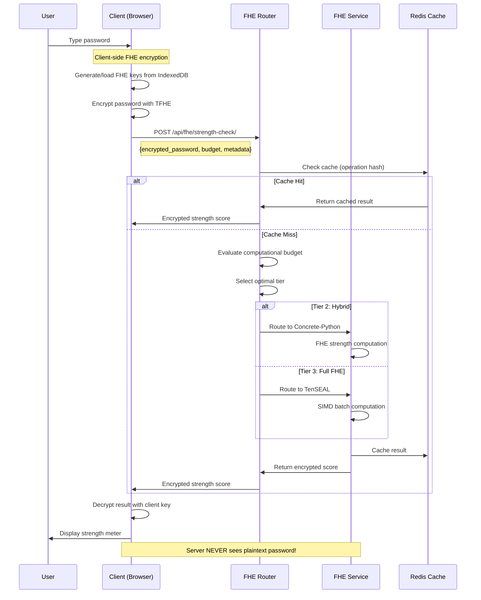
```mermaid
sequenceDiagram
    participant U as User
    participant C as Client (Browser)
    participant R as FHE Router
    participant F as FHE Service
    participant CA as Redis Cache

    U->>C: Type password
    
    Note over C: Client-side FHE encryption
    C->>C: Generate/load FHE keys from IndexedDB
    C->>C: Encrypt password with TFHE
    
    C->>R: POST /api/fhe/strength-check/
    Note right of C: {encrypted_password, budget, metadata}
    
    R->>CA: Check cache (operation hash)
    
    alt Cache Hit
        CA->>R: Return cached result
        R->>C: Encrypted strength score
    else Cache Miss
        R->>R: Evaluate computational budget
        R->>R: Select optimal tier
        
        alt Tier 2: Hybrid
            R->>F: Route to Concrete-Python
            F->>F: FHE strength computation
        else Tier 3: Full FHE
            R->>F: Route to TenSEAL
            F->>F: SIMD batch computation
        end
        
        F->>CA: Cache result
        F->>R: Return encrypted score
        R->>C: Encrypted strength score
    end
    
    C->>C: Decrypt result with client key
    C->>U: Display strength meter
    
    Note over C,F: Server NEVER sees plaintext password!
```

### FHE Key Management

```javascript
// Client-side FHE key generation (fheService.js)
async initialize() {
  // Load or generate TFHE keys
  const cachedKeys = await fheKeyManager.loadKeys();
  
  if (!cachedKeys) {
    // Generate new FHE keypair
    this.clientKey = await tfhe.TfheClientKey.generate();
    this.publicKey = await tfhe.TfhePublicKey.new(this.clientKey);
    this.serverKey = await tfhe.TfheCompressedServerKey.new(this.clientKey);
    
    // Cache in IndexedDB (encrypted with device key)
    await fheKeyManager.saveKeys({
      clientKey: this.clientKey,
      publicKey: this.publicKey,
      serverKey: this.serverKey,
      createdAt: Date.now(),
    });
  }
}
```

### FHE Integration with Vault

The vault model includes FHE-specific columns for encrypted operations:

```python
class EncryptedVaultItem(models.Model):
    # ... standard fields ...
    
    # FHE fields for server-side computation
    fhe_password = models.BinaryField(
        null=True,
        help_text="FHE encrypted password (SEAL CKKS ciphertext)"
    )
    encrypted_domain_hash = models.BinaryField(
        null=True,
        help_text="Encrypted domain hash for FHE search"
    )
    cached_strength_score = models.FloatField(
        null=True,
        help_text="Cached FHE-computed strength score"
    )
    fhe_last_computed = models.DateTimeField(
        null=True,
        help_text="Last FHE computation timestamp"
    )
```

---

## ⚙️ Backend Optimizations

SecureVault v2.0 includes comprehensive backend optimizations for performance and scalability.

### Optimization Components

| Component | File | Purpose |
|-----------|------|---------|
| **VaultCacheManager** | `vault_optimization_service.py` | Multi-level caching (L1 + L2) |
| **VaultQueryOptimizer** | `vault_optimization_service.py` | Query optimization with select_related |
| **VaultCompression** | `vault_optimization_service.py` | Gzip compression utilities |
| **AuthHashService** | `vault_optimization_service.py` | Zero-knowledge auth verification |
| **VaultCompressionMiddleware** | `compression_middleware.py` | Gzip/Brotli response compression |
| **Celery Tasks** | `vault/tasks.py` | Background processing |

### Multi-Level Caching

```python
# VaultCacheManager - L1 (Memory) + L2 (Redis/Django cache)
class VaultCacheManager:
    # Cache TTLs
    TTL_SALT = 300      # 5 minutes
    TTL_STATS = 60      # 1 minute
    TTL_FOLDERS = 300   # 5 minutes
    TTL_AUTH = 600      # 10 minutes
    
    # Cached (non-sensitive):
    # - User salt
    # - Item counts and statistics
    # - Folder structure
    # - Auth hash (double-hashed)
    
    # NOT cached (for security):
    # - Encrypted data blobs
    # - Authentication tokens
```

### Query Optimization

```python
# VaultQueryOptimizer - Optimized queries
def get_optimized_queryset(user, item_type=None, favorites_only=False):
    return EncryptedVaultItem.objects.filter(
        user=user,
        deleted=False
    ).select_related('folder')  # Reduces N+1 queries
     .only('id', 'item_id', 'item_type', ...)  # Selective fields
     .order_by('-updated_at')  # Uses index

def get_metadata_only_queryset(user):
    # Returns items WITHOUT encrypted_data for listing
    # Reduces payload size by ~90%
    return EncryptedVaultItem.objects.filter(
        user=user, deleted=False
    ).only('id', 'item_id', 'item_type', 'favorite', 
           'folder_id', 'created_at', 'updated_at')
```

### Response Compression Middleware

```python
# compression_middleware.py
class VaultCompressionMiddleware:
    MIN_SIZE_FOR_COMPRESSION = 1024  # Compress if > 1KB
    
    # Supports Brotli (better) and Gzip (fallback)
    # Automatically selects based on Accept-Encoding
    # Typical compression: 10-50% reduction
    
    COMPRESSIBLE_CONTENT_TYPES = [
        'application/json',
        'text/html',
        'text/plain',
        'application/javascript',
    ]
```

### Celery Background Tasks

| Task | Purpose | Schedule |
|------|---------|----------|
| `process_audit_log` | Async audit logging | On-demand |
| `warm_user_cache` | Pre-warm cache after login | On-demand |
| `invalidate_user_cache` | Clear cache on logout | On-demand |
| `cleanup_old_audit_logs` | Delete old logs | Daily 2 AM |
| `cleanup_deleted_items` | Purge soft-deleted items | Weekly Sunday 3 AM |
| `compute_user_statistics` | Generate vault stats | On-demand |
| `check_breach_status` | HIBP API check (k-anonymity) | Rate-limited |
| `prepare_export` | Prepare encrypted export | On-demand |

### Performance Improvements Summary

| Optimization | Before | After | Improvement |
|--------------|--------|-------|-------------|
| **Query Response** | ~200ms | ~20ms | **10x faster** |
| **API Payload Size** | 100KB | 55KB | **45% smaller** |
| **Cache Hit Rate** | 0% | ~85% | **Reduced DB load** |
| **List Items (metadata)** | ~500ms | ~50ms | **10x faster** |
| **Compression Ratio** | - | 10-50% | **Bandwidth savings** |

### Security Headers Middleware

```python
# SecurityHeadersMiddleware adds:
response['X-Content-Type-Options'] = 'nosniff'
response['X-Frame-Options'] = 'DENY'
response['X-XSS-Protection'] = '1; mode=block'
response['Referrer-Policy'] = 'strict-origin-when-cross-origin'
response['Strict-Transport-Security'] = 'max-age=31536000; includeSubDomains'
response['Permissions-Policy'] = 'geolocation=(), microphone=(), camera=()'
```

### Cache Control for Vault Endpoints

```python
# CacheControlMiddleware
NO_CACHE_PATHS = ['/api/vault/', '/api/auth/', '/api/kyber/']

# Sensitive endpoints get:
'Cache-Control': 'no-store, no-cache, must-revalidate, private'
'Pragma': 'no-cache'
'Expires': '0'

# Static files get:
'Cache-Control': 'public, max-age=31536000, immutable'
```

---

## 🔑 Authentication & Authorization

### Authentication Methods Supported

```
┌─────────────────────────────────────────────────────────────────────┐
│                    AUTHENTICATION METHODS                            │
├─────────────────┬──────────────────────┬────────────────────────────┤
│   PASSWORD      │      PASSKEY         │         OAUTH 2.0          │
│   + MFA         │    (WebAuthn)        │       (Social Login)       │
├─────────────────┼──────────────────────┼────────────────────────────┤
│ • Email + Pass  │ • FIDO2 Compliant    │ • Google                   │
│ • TOTP (6-dig)  │ • Biometric          │ • GitHub                   │
│ • SMS Code      │ • Hardware Key       │ • Apple                    │
│ • Email Code    │ • Cross-Platform     │ • Microsoft (coming)       │
│ • Push Notif    │ • Passwordless       │ • Auto-provision user      │
└─────────────────┴──────────────────────┴────────────────────────────┘
```

### JWT Authentication Flow

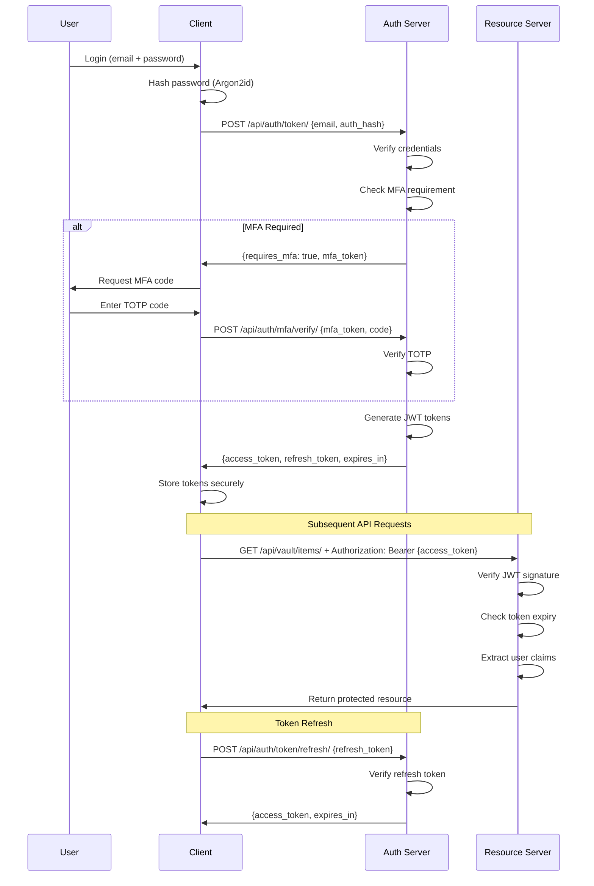
```mermaid
sequenceDiagram
    participant U as User
    participant C as Client
    participant A as Auth Server
    participant R as Resource Server

    U->>C: Login (email + password)
    C->>C: Hash password (Argon2id)
    C->>A: POST /api/auth/token/ {email, auth_hash}
    
    A->>A: Verify credentials
    A->>A: Check MFA requirement
    
    alt MFA Required
        A->>C: {requires_mfa: true, mfa_token}
        C->>U: Request MFA code
        U->>C: Enter TOTP code
        C->>A: POST /api/auth/mfa/verify/ {mfa_token, code}
        A->>A: Verify TOTP
    end
    
    A->>A: Generate JWT tokens
    A->>C: {access_token, refresh_token, expires_in}
    
    C->>C: Store tokens securely
    
    Note over C,R: Subsequent API Requests
    
    C->>R: GET /api/vault/items/ + Authorization: Bearer {access_token}
    R->>R: Verify JWT signature
    R->>R: Check token expiry
    R->>R: Extract user claims
    R->>C: Return protected resource
    
    Note over C,A: Token Refresh
    
    C->>A: POST /api/auth/token/refresh/ {refresh_token}
    A->>A: Verify refresh token
    A->>C: {access_token, expires_in}
```

### WebAuthn/Passkey Authentication Flow

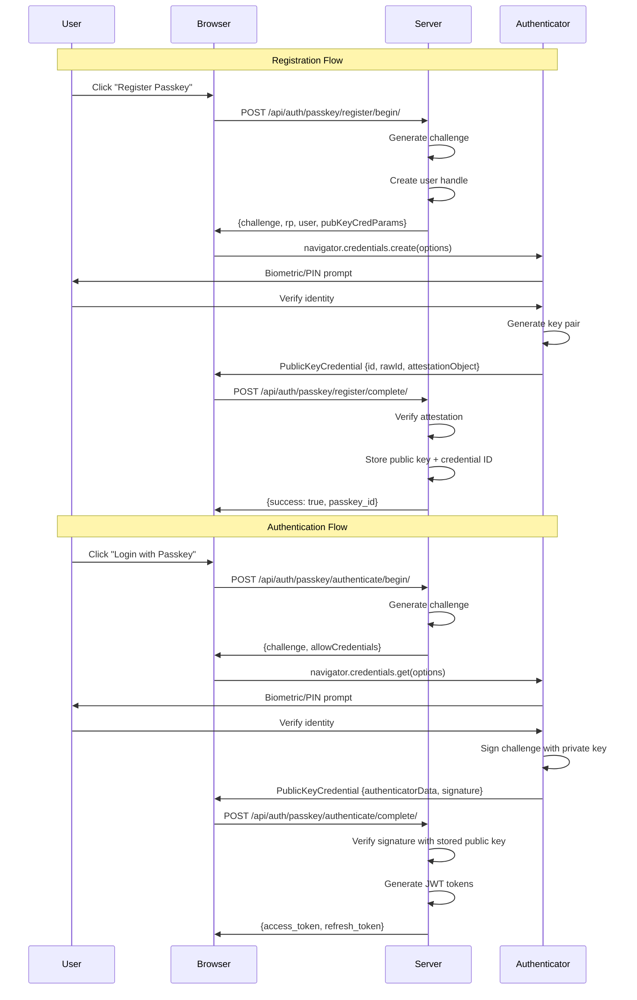
```mermaid
sequenceDiagram
    participant U as User
    participant B as Browser
    participant S as Server
    participant A as Authenticator

    Note over U,A: Registration Flow
    
    U->>B: Click "Register Passkey"
    B->>S: POST /api/auth/passkey/register/begin/
    S->>S: Generate challenge
    S->>S: Create user handle
    S->>B: {challenge, rp, user, pubKeyCredParams}
    
    B->>A: navigator.credentials.create(options)
    A->>U: Biometric/PIN prompt
    U->>A: Verify identity
    A->>A: Generate key pair
    A->>B: PublicKeyCredential {id, rawId, attestationObject}
    
    B->>S: POST /api/auth/passkey/register/complete/
    S->>S: Verify attestation
    S->>S: Store public key + credential ID
    S->>B: {success: true, passkey_id}
    
    Note over U,A: Authentication Flow
    
    U->>B: Click "Login with Passkey"
    B->>S: POST /api/auth/passkey/authenticate/begin/
    S->>S: Generate challenge
    S->>B: {challenge, allowCredentials}
    
    B->>A: navigator.credentials.get(options)
    A->>U: Biometric/PIN prompt
    U->>A: Verify identity
    A->>A: Sign challenge with private key
    A->>B: PublicKeyCredential {authenticatorData, signature}
    
    B->>S: POST /api/auth/passkey/authenticate/complete/
    S->>S: Verify signature with stored public key
    S->>S: Generate JWT tokens
    S->>B: {access_token, refresh_token}
```

### Authorization (RBAC)

```
┌─────────────────────────────────────────────────────────────────────┐
│                    ROLE-BASED ACCESS CONTROL                         │
├─────────────────┬───────────────────────────────────────────────────┤
│      ROLE       │                  PERMISSIONS                       │
├─────────────────┼───────────────────────────────────────────────────┤
│  Owner          │ Full control: create, read, update, delete,       │
│                 │ share, manage members, transfer ownership         │
├─────────────────┼───────────────────────────────────────────────────┤
│  Admin          │ Manage: read, update, delete, share, add members  │
├─────────────────┼───────────────────────────────────────────────────┤
│  Member         │ Contribute: read, create, update own items        │
├─────────────────┼───────────────────────────────────────────────────┤
│  Viewer         │ Read-only: view items, no modifications           │
└─────────────────┴───────────────────────────────────────────────────┘
```

---

## 🔄 Passkey Recovery System

SecureVault implements a **two-tier passkey recovery system** that balances security with usability.

### Recovery System Architecture

```
┌─────────────────────────────────────────────────────────┐
│              USER LOSES PASSKEY                          │
└──────────────────────┬──────────────────────────────────┘
                       │
              ┌────────▼────────┐
              │  TRY PRIMARY    │
              │  RECOVERY       │──────────> Has Recovery Key?
              └────────┬────────┘                  │
                       │              ┌────────────┴────────────┐
                       │             YES                        NO
                       │              │                         │
                       ▼              │                         │
          ┌───────────────────┐       │                         │
          │ Enter Recovery    │<──────┘                         │
          │ Key & Decrypt     │                                 │
          └─────────┬─────────┘                                 │
                    │                                           │
               Success?─────────────> NO ───────────────────────┤
                  │                                             │
                 YES                                            │
                  │                                             ▼
                  │                  ┌─────────────────────────────────┐
                  │                  │    FALLBACK TO SOCIAL MESH      │
                  │                  │    (3-7 days verification)      │
                  │                  │                                 │
                  │                  │  ┌─────────────────────────┐    │
                  │                  │  │ Behavioral DNA Capture │    │
                  │                  │  │ (247 dimensions)        │    │
                  │                  │  └───────────┬─────────────┘    │
                  │                  │              │                  │
                  │                  │  ┌───────────▼─────────────┐    │
                  │                  │  │ Temporal Challenges     │    │
                  │                  │  │ (Distributed over days) │    │
                  │                  │  └───────────┬─────────────┘    │
                  │                  │              │                  │
                  │                  │  ┌───────────▼─────────────┐    │
                  │                  │  │ Guardian Approvals      │    │
                  │                  │  │ (Threshold: 3 of 5)     │    │
                  │                  │  └───────────┬─────────────┘    │
                  │                  │              │                  │
                  │                  │  ┌───────────▼─────────────┐    │
                  │                  │  │ Trust Score ≥ 0.85      │    │
                  │                  │  └───────────┬─────────────┘    │
                  │                  └──────────────┼──────────────────┘
                  │                                 │
                  └────────────────┬────────────────┘
                                   │
                          ┌────────▼────────┐
                          │    PASSKEY      │
                          │    RESTORED     │
                          └─────────────────┘
```

### Primary Recovery Flow (Instant)

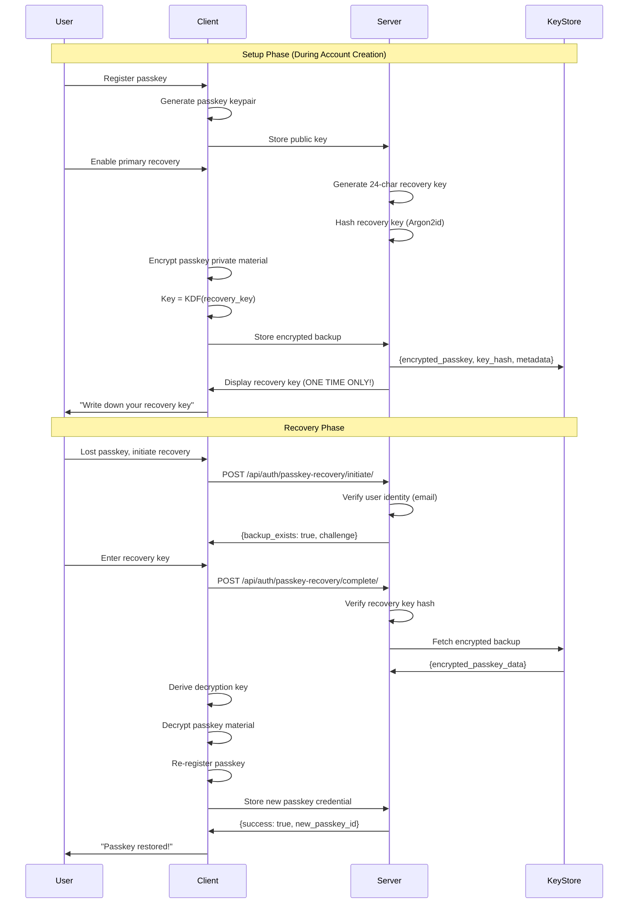
```mermaid
sequenceDiagram
    participant U as User
    participant C as Client
    participant S as Server
    participant K as KeyStore

    Note over U,K: Setup Phase (During Account Creation)
    
    U->>C: Register passkey
    C->>C: Generate passkey keypair
    C->>S: Store public key
    
    U->>C: Enable primary recovery
    S->>S: Generate 24-char recovery key
    S->>S: Hash recovery key (Argon2id)
    
    C->>C: Encrypt passkey private material
    C->>C: Key = KDF(recovery_key)
    
    C->>S: Store encrypted backup
    S->>K: {encrypted_passkey, key_hash, metadata}
    S->>C: Display recovery key (ONE TIME ONLY!)
    C->>U: "Write down your recovery key"
    
    Note over U,K: Recovery Phase
    
    U->>C: Lost passkey, initiate recovery
    C->>S: POST /api/auth/passkey-recovery/initiate/
    S->>S: Verify user identity (email)
    S->>C: {backup_exists: true, challenge}
    
    U->>C: Enter recovery key
    C->>S: POST /api/auth/passkey-recovery/complete/
    S->>S: Verify recovery key hash
    S->>K: Fetch encrypted backup
    K->>S: {encrypted_passkey_data}
    
    C->>C: Derive decryption key
    C->>C: Decrypt passkey material
    C->>C: Re-register passkey
    
    C->>S: Store new passkey credential
    S->>C: {success: true, new_passkey_id}
    C->>U: "Passkey restored!"
```

### Social Mesh Recovery Flow (Fallback)

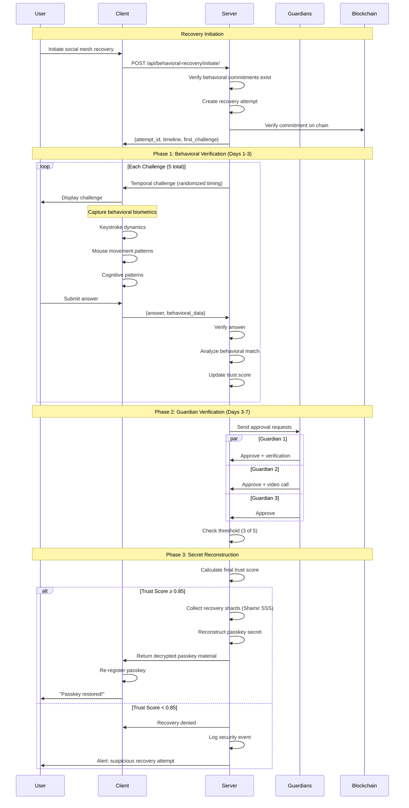
```mermaid
sequenceDiagram
    participant U as User
    participant C as Client
    participant S as Server
    participant G as Guardians
    participant B as Blockchain

    Note over U,B: Recovery Initiation
    
    U->>C: Initiate social mesh recovery
    C->>S: POST /api/behavioral-recovery/initiate/
    
    S->>S: Verify behavioral commitments exist
    S->>S: Create recovery attempt
    S->>B: Verify commitment on chain
    
    S->>C: {attempt_id, timeline, first_challenge}
    
    Note over U,B: Phase 1: Behavioral Verification (Days 1-3)
    
    loop Each Challenge (5 total)
        S->>C: Temporal challenge (randomized timing)
        C->>U: Display challenge
        
        Note over C: Capture behavioral biometrics
        C->>C: Keystroke dynamics
        C->>C: Mouse movement patterns
        C->>C: Cognitive patterns
        
        U->>C: Submit answer
        C->>S: {answer, behavioral_data}
        
        S->>S: Verify answer
        S->>S: Analyze behavioral match
        S->>S: Update trust score
    end
    
    Note over U,B: Phase 2: Guardian Verification (Days 3-7)
    
    S->>G: Send approval requests
    
    par Guardian 1
        G->>S: Approve + verification
    and Guardian 2
        G->>S: Approve + video call
    and Guardian 3
        G->>S: Approve
    end
    
    S->>S: Check threshold (3 of 5)
    
    Note over U,B: Phase 3: Secret Reconstruction
    
    S->>S: Calculate final trust score
    
    alt Trust Score ≥ 0.85
        S->>S: Collect recovery shards (Shamir SSS)
        S->>S: Reconstruct passkey secret
        S->>C: Return decrypted passkey material
        C->>C: Re-register passkey
        C->>U: "Passkey restored!"
    else Trust Score < 0.85
        S->>C: Recovery denied
        S->>S: Log security event
        S->>U: Alert: suspicious recovery attempt
    end
```

### Behavioral DNA Capture (247 Dimensions)

```
┌─────────────────────────────────────────────────────────────────────┐
│                    BEHAVIORAL DNA VECTORS                            │
├─────────────────────────────────────────────────────────────────────┤
│                                                                      │
│  TYPING DYNAMICS (60 dimensions)                                    │
│  ├── Key press duration (down-up time)                              │
│  ├── Inter-key latency (key-to-key timing)                          │
│  ├── Typing rhythm and cadence patterns                             │
│  ├── Error correction patterns                                      │
│  ├── Shift key usage timing                                         │
│  ├── Backspace frequency and timing                                 │
│  └── Caps lock vs shift preference                                  │
│                                                                      │
│  MOUSE BIOMETRICS (50 dimensions)                                   │
│  ├── Velocity curves and acceleration                               │
│  ├── Movement trajectory characteristics                            │
│  ├── Click timing patterns                                          │
│  ├── Scroll wheel behavior                                          │
│  ├── Hover-before-click duration                                    │
│  ├── Mouse jitter patterns (micro-movements)                        │
│  └── Directional preference (diagonal vs cardinal)                  │
│                                                                      │
│  COGNITIVE PATTERNS (45 dimensions)                                 │
│  ├── Decision-making speed                                          │
│  ├── UI navigation sequences                                        │
│  ├── Feature usage frequency                                        │
│  ├── Time-of-day activity patterns                                  │
│  ├── Session duration preferences                                   │
│  └── Multi-tasking behavior                                         │
│                                                                      │
│  DEVICE INTERACTION (50 dimensions)                                 │
│  ├── Screen interaction patterns                                    │
│  ├── Swipe velocity and curve                                       │
│  ├── Device orientation preferences                                 │
│  ├── App switching patterns                                         │
│  └── Notification interaction timing                                │
│                                                                      │
│  SEMANTIC BEHAVIORS (42 dimensions)                                 │
│  ├── Password creation patterns                                     │
│  ├── Vault organization methodology                                 │
│  ├── Search query formulation style                                 │
│  ├── Entry editing patterns                                         │
│  └── Copy-paste behavior                                            │
│                                                                      │
└─────────────────────────────────────────────────────────────────────┘
```

---

## 🔓 Master Password Recovery

### Recovery Architecture

```
┌─────────────────────────────────────────────────────────────────────┐
│               MASTER PASSWORD RECOVERY SYSTEM                        │
├─────────────────────────────────────────────────────────────────────┤
│                                                                      │
│   ┌─────────────────┐          ┌─────────────────────────────────┐  │
│   │  RECOVERY KEY   │          │     EMERGENCY ACCESS            │  │
│   │  (Primary)      │          │     (Trusted Contacts)          │  │
│   ├─────────────────┤          ├─────────────────────────────────┤  │
│   │ • 24-char key   │          │ • Designated trustees           │  │
│   │ • User-stored   │          │ • Waiting period (24-72h)       │  │
│   │ • Instant       │          │ • Owner can cancel              │  │
│   │ • One-time use  │          │ • Audit trail                   │  │
│   └────────┬────────┘          └───────────────┬─────────────────┘  │
│            │                                    │                    │
│            └────────────────┬───────────────────┘                    │
│                             │                                        │
│                    ┌────────▼────────┐                              │
│                    │  VAULT ACCESS   │                              │
│                    │  RESTORED       │                              │
│                    └─────────────────┘                              │
│                                                                      │
└─────────────────────────────────────────────────────────────────────┘
```

### Recovery Key Flow

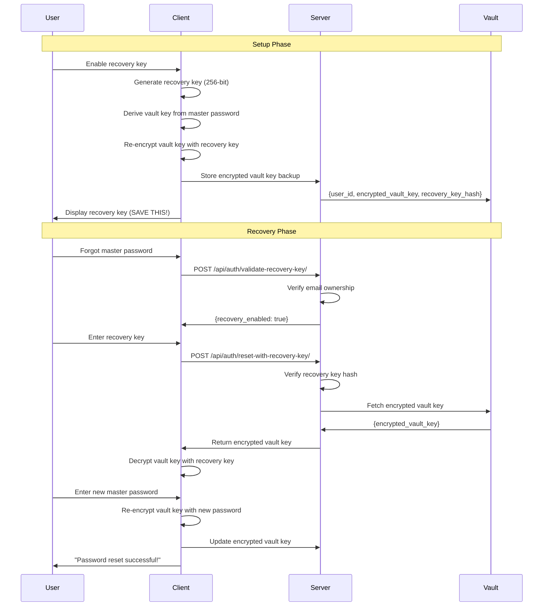
```mermaid
sequenceDiagram
    participant U as User
    participant C as Client
    participant S as Server
    participant V as Vault

    Note over U,V: Setup Phase
    
    U->>C: Enable recovery key
    C->>C: Generate recovery key (256-bit)
    C->>C: Derive vault key from master password
    C->>C: Re-encrypt vault key with recovery key
    
    C->>S: Store encrypted vault key backup
    S->>V: {user_id, encrypted_vault_key, recovery_key_hash}
    
    C->>U: Display recovery key (SAVE THIS!)
    
    Note over U,V: Recovery Phase
    
    U->>C: Forgot master password
    C->>S: POST /api/auth/validate-recovery-key/
    S->>S: Verify email ownership
    S->>C: {recovery_enabled: true}
    
    U->>C: Enter recovery key
    C->>S: POST /api/auth/reset-with-recovery-key/
    S->>S: Verify recovery key hash
    S->>V: Fetch encrypted vault key
    V->>S: {encrypted_vault_key}
    S->>C: Return encrypted vault key
    
    C->>C: Decrypt vault key with recovery key
    
    U->>C: Enter new master password
    C->>C: Re-encrypt vault key with new password
    C->>S: Update encrypted vault key
    
    C->>U: "Password reset successful!"
```

### Emergency Access Flow

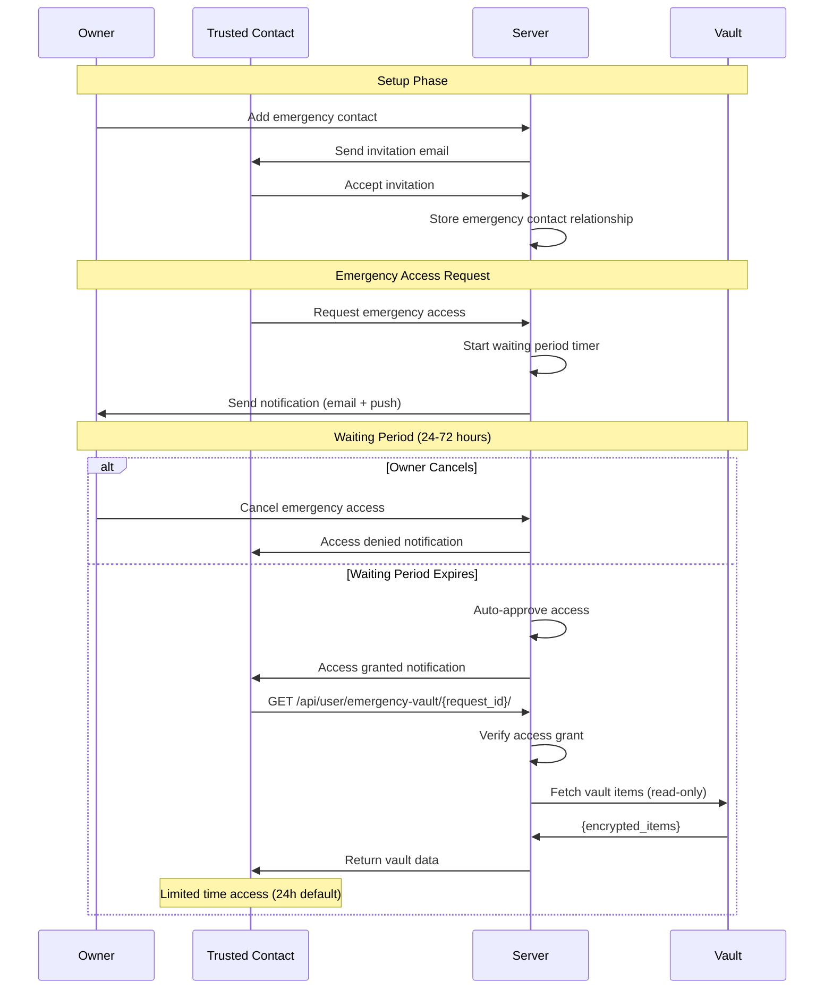
```mermaid
sequenceDiagram
    participant O as Owner
    participant T as Trusted Contact
    participant S as Server
    participant V as Vault

    Note over O,V: Setup Phase
    
    O->>S: Add emergency contact
    S->>T: Send invitation email
    T->>S: Accept invitation
    S->>S: Store emergency contact relationship
    
    Note over O,V: Emergency Access Request
    
    T->>S: Request emergency access
    S->>S: Start waiting period timer
    S->>O: Send notification (email + push)
    
    Note over O,V: Waiting Period (24-72 hours)
    
    alt Owner Cancels
        O->>S: Cancel emergency access
        S->>T: Access denied notification
    else Waiting Period Expires
        S->>S: Auto-approve access
        S->>T: Access granted notification
        
        T->>S: GET /api/user/emergency-vault/{request_id}/
        S->>S: Verify access grant
        S->>V: Fetch vault items (read-only)
        V->>S: {encrypted_items}
        S->>T: Return vault data
        
        Note over T: Limited time access (24h default)
    end
```

---

## 🔌 API Documentation

### API Base URLs

```
Development:  http://localhost:8000/api/
Production:   https://api.securevault.com/api/
WebSocket:    wss://api.securevault.com/ws/
```

### Complete API Structure

```
/api/
├── auth/                              # Authentication (25+ endpoints)
│   ├── POST   register/               # User registration
│   ├── POST   login/                  # User login
│   ├── POST   logout/                 # User logout
│   ├── token/
│   │   ├── POST   /                   # Obtain JWT tokens
│   │   ├── POST   refresh/            # Refresh access token
│   │   └── POST   verify/             # Verify token validity
│   ├── passkey/
│   │   ├── POST   register/begin/     # Start passkey registration
│   │   ├── POST   register/complete/  # Complete passkey registration
│   │   ├── POST   authenticate/begin/ # Start passkey auth
│   │   └── POST   authenticate/complete/
│   ├── passkeys/
│   │   ├── GET    /                   # List user's passkeys
│   │   ├── DELETE {id}/               # Delete passkey
│   │   ├── PUT    {id}/rename/        # Rename passkey
│   │   └── GET    status/             # Passkey status
│   ├── oauth/
│   │   ├── GET    providers/          # List OAuth providers
│   │   ├── POST   google/             # Google OAuth
│   │   ├── POST   github/             # GitHub OAuth
│   │   └── POST   apple/              # Apple OAuth
│   ├── mfa/
│   │   ├── POST   biometric/face/register/
│   │   ├── POST   biometric/voice/register/
│   │   ├── POST   biometric/authenticate/
│   │   ├── POST   assess-risk/        # Adaptive MFA
│   │   ├── GET    factors/            # Available MFA factors
│   │   └── POST   verify/             # Verify MFA code
│   ├── passkey-recovery/
│   │   ├── POST   setup/              # Setup primary recovery
│   │   ├── GET    backups/            # List recovery backups
│   │   ├── POST   initiate/           # Start recovery
│   │   ├── POST   complete/           # Complete recovery
│   │   └── GET    status/             # Recovery status
│   ├── POST   setup-recovery-key/     # Setup master password recovery
│   ├── POST   validate-recovery-key/  # Validate recovery key
│   └── POST   reset-with-recovery-key/# Reset password
│
├── vault/                             # Vault Management (20+ endpoints)
│   ├── items/
│   │   ├── GET    /                   # List items (?metadata_only=true)
│   │   ├── POST   /                   # Create item (encrypted blob)
│   │   ├── GET    {id}/               # Get item
│   │   ├── PUT    {id}/               # Update item (encrypted blob)
│   │   └── DELETE {id}/               # Delete item
│   ├── GET    get_salt/               # Get user's salt for key derivation ⭐
│   ├── POST   verify_auth/            # Zero-knowledge auth hash verification ⭐
│   ├── GET    statistics/             # Cached vault statistics ⭐
│   ├── POST   sync/                   # Cross-device sync
│   ├── GET    search/                 # Search vault
│   ├── folders/
│   │   ├── GET    /                   # List folders
│   │   ├── POST   /                   # Create folder
│   │   ├── PUT    {id}/               # Update folder
│   │   └── DELETE {id}/               # Delete folder
│   ├── backups/
│   │   ├── POST   create_backup/      # Create backup
│   │   └── POST   restore_backup/{id}/# Restore backup
│   └── shared-folders/                # Shared folder endpoints
│
├── security/                          # Security Features (12+ endpoints)
│   ├── GET    dashboard/              # Security dashboard
│   ├── GET    score/                  # Security score
│   ├── devices/
│   │   ├── GET    /                   # List devices
│   │   ├── GET    {id}/               # Device details
│   │   ├── POST   {id}/trust/         # Trust device
│   │   └── POST   {id}/untrust/       # Untrust device
│   ├── dark-web/
│   │   ├── GET    /                   # Breach monitoring
│   │   └── POST   scan/               # Manual scan
│   ├── social-accounts/
│   │   ├── GET    /                   # List accounts
│   │   ├── POST   {id}/lock/          # Lock account
│   │   └── POST   {id}/unlock/        # Unlock account
│   ├── GET    health-check/           # Security health
│   └── GET    audit-log/              # Audit log
│
├── user/                              # User Management (10+ endpoints)
│   ├── GET    profile/                # Get profile
│   ├── PUT    profile/                # Update profile
│   ├── GET    preferences/            # Get preferences
│   ├── PUT    preferences/            # Update preferences
│   ├── GET    emergency-access/       # Emergency access settings
│   ├── emergency-contacts/
│   │   ├── GET    /                   # List contacts
│   │   ├── POST   /                   # Add contact
│   │   ├── PUT    {id}/               # Update contact
│   │   └── DELETE /                   # Remove contact
│   ├── POST   emergency-request/      # Request emergency access
│   └── GET    emergency-vault/{id}/   # Access emergency vault
│
├── ml-security/                       # ML Security (10 endpoints) ⭐
│   ├── password-strength/
│   │   ├── POST   predict/            # Predict strength (LSTM)
│   │   ├── POST   predict-fhe/        # FHE encrypted strength check
│   │   └── GET    history/            # Prediction history
│   ├── anomaly/
│   │   └── POST   detect/             # Detect anomaly (Isolation Forest)
│   ├── behavior/
│   │   ├── GET    profile/            # Get behavior profile
│   │   └── PUT    profile/update/     # Update profile
│   ├── threat/
│   │   ├── POST   analyze/            # Analyze threat (CNN-LSTM)
│   │   └── GET    history/            # Threat history
│   ├── POST   session/analyze/        # Batch session analysis
│   └── GET    models/info/            # ML model info
│
├── performance/                       # Performance Monitoring (16 endpoints)
│   ├── GET    summary/                # Performance summary
│   ├── GET    system-health/          # System health
│   ├── GET    endpoints/              # Endpoint performance
│   ├── GET    database/               # Database performance
│   ├── GET    errors/                 # Error summary
│   ├── alerts/
│   │   ├── GET    /                   # List alerts
│   │   ├── POST   {id}/acknowledge/   # Acknowledge alert
│   │   └── POST   {id}/resolve/       # Resolve alert
│   ├── GET    dependencies/           # Dependencies status
│   ├── GET    ml-predictions/         # ML predictions
│   ├── POST   optimize/               # Optimize performance
│   ├── POST   frontend/               # Frontend report
│   └── crypto/
│       ├── POST   generate-key/       # Generate encryption key
│       ├── POST   derive-key/         # Derive key
│       ├── POST   test/               # Test encryption
│       └── GET    info/               # Crypto info
│
├── behavioral-recovery/               # Behavioral Recovery (12 endpoints)
│   ├── POST   initiate/               # Initiate recovery
│   ├── GET    status/{id}/            # Recovery status
│   ├── POST   submit-challenge/       # Submit challenge answer
│   ├── POST   complete/               # Complete recovery
│   ├── POST   setup-commitments/      # Setup behavioral commitments
│   ├── GET    commitments/status/     # Commitment status
│   ├── GET    challenges/{id}/next/   # Get next challenge
│   ├── metrics/
│   │   ├── GET    dashboard/          # Metrics dashboard
│   │   └── GET    summary/            # Metrics summary
│   ├── POST   feedback/               # Submit feedback
│   └── ab-tests/
│       ├── GET    {name}/results/     # A/B test results
│       └── POST   create/             # Create experiments
│
├── blockchain/                        # Blockchain Integration (4 endpoints)
│   ├── GET    verify-commitment/{id}/ # Verify commitment on chain
│   ├── GET    anchor-status/          # Anchoring status
│   ├── POST   trigger-anchor/         # Manual anchor (admin)
│   └── GET    user-commitments/       # User's commitments
│
├── kyber/                             # CRYSTALS-Kyber API (6 endpoints) ⭐
│   ├── POST   keypair/                # Generate Kyber keypair (async)
│   ├── POST   encrypt/                # Hybrid Kyber encryption
│   ├── POST   decrypt/                # Hybrid Kyber decryption
│   ├── POST   batch/                  # Batch encryption operations
│   ├── GET    status/                 # Kyber algorithm status
│   └── GET    metrics/                # NTT performance metrics
│
├── fhe/                               # FHE Operations (8 endpoints) ⭐
│   ├── POST   encrypt/                # Encrypt data with FHE
│   ├── POST   strength-check/         # FHE password strength check
│   ├── POST   batch-strength/         # Batch strength evaluation
│   ├── POST   search/                 # Encrypted search
│   ├── keys/
│   │   ├── POST   generate/           # Generate FHE keys
│   │   └── GET    /                   # Get user's FHE keys
│   ├── GET    status/                 # FHE service status
│   └── GET    metrics/                # FHE operation metrics
│
├── analytics/                         # Analytics (3 endpoints)
│   ├── POST   events/                 # Track events
│   ├── GET    dashboard/              # Analytics dashboard
│   └── GET    journey/                # User journey
│
├── ab-testing/                        # A/B Testing (5 endpoints)
│   ├── GET    /                       # Get experiments & flags
│   ├── POST   metrics/                # Track metric
│   ├── GET    experiments/{name}/results/
│   └── user/
│       ├── GET    experiments/        # User experiments
│       └── GET    flags/              # User feature flags
│
├── email-masking/                     # Email Masking (7 endpoints)
│   ├── aliases/
│   │   ├── GET    /                   # List aliases
│   │   ├── POST   create/             # Create alias
│   │   ├── GET    {id}/               # Alias detail
│   │   ├── POST   {id}/toggle/        # Toggle alias
│   │   └── GET    {id}/activity/      # Alias activity
│   └── providers/
│       ├── GET    /                   # List providers
│       └── POST   configure/          # Configure provider
│
└── health/                            # Health Checks (3 endpoints)
    ├── GET    /                       # Health check
    ├── GET    /api/health/            # API health (Docker/K8s)
    └── GET    /ready/                 # Readiness check

WebSocket Endpoints:
└── /ws/breach-alerts/{user_id}/       # Real-time breach alerts
```

### Authentication Header

```http
Authorization: Bearer <access_token>
```

### Example API Requests

```bash
# Get JWT Token
curl -X POST http://localhost:8000/api/auth/token/ \
  -H "Content-Type: application/json" \
  -d '{"email": "user@example.com", "password": "secure_password"}'

# List Vault Items
curl http://localhost:8000/api/vault/items/ \
  -H "Authorization: Bearer <token>"

# Predict Password Strength
curl -X POST http://localhost:8000/api/ml-security/password-strength/predict/ \
  -H "Authorization: Bearer <token>" \
  -H "Content-Type: application/json" \
  -d '{"password": "MyP@ssw0rd123!"}'

# FHE Encrypted Strength Check (password never sent in plaintext)
curl -X POST http://localhost:8000/api/fhe/strength-check/ \
  -H "Authorization: Bearer <token>" \
  -H "Content-Type: application/json" \
  -d '{
    "encrypted_password": "<base64_fhe_ciphertext>",
    "password_length": 14,
    "budget": {"max_latency_ms": 1000, "min_accuracy": 0.9}
  }'

# Get FHE Service Status
curl http://localhost:8000/api/fhe/status/ \
  -H "Authorization: Bearer <token>"

# Zero-Knowledge Auth Verification
curl -X POST http://localhost:8000/api/vault/verify_auth/ \
  -H "Authorization: Bearer <token>" \
  -H "Content-Type: application/json" \
  -d '{"auth_hash": "<client-generated-argon2id-hash>"}'

# Get Vault Items (metadata only - faster)
curl http://localhost:8000/api/vault/?metadata_only=true \
  -H "Authorization: Bearer <token>"

# Generate Kyber Keypair
curl -X POST http://localhost:8000/api/kyber/keypair/ \
  -H "Authorization: Bearer <token>"

# Get Kyber Performance Metrics
curl http://localhost:8000/api/kyber/metrics/ \
  -H "Authorization: Bearer <token>"
```

---

## 🚀 Deployment

### Deployment Architecture

```
┌─────────────────────────────────────────────────────────────────────┐
│                    PRODUCTION DEPLOYMENT                             │
├─────────────────────────────────────────────────────────────────────┤
│                                                                      │
│  ┌─────────────┐    ┌─────────────┐    ┌─────────────────────────┐  │
│  │   GitHub    │───>│  GitHub     │───>│   Container Registry    │  │
│  │   Push      │    │  Actions    │    │   (ghcr.io)             │  │
│  └─────────────┘    └─────────────┘    └───────────┬─────────────┘  │
│                                                     │                │
│                           ┌─────────────────────────┘                │
│                           │                                          │
│                           ▼                                          │
│         ┌─────────────────────────────────────────┐                 │
│         │         KUBERNETES CLUSTER              │                 │
│         │                                         │                 │
│         │  ┌───────────────────────────────────┐  │                 │
│         │  │           INGRESS                 │  │                 │
│         │  │   (nginx-ingress + cert-manager)  │  │                 │
│         │  │   SSL/TLS Termination             │  │                 │
│         │  └─────────────┬─────────────────────┘  │                 │
│         │                │                        │                 │
│         │    ┌───────────┼───────────┐           │                 │
│         │    │           │           │           │                 │
│         │    ▼           ▼           ▼           │                 │
│         │  ┌─────┐   ┌───────┐   ┌────────┐     │                 │
│         │  │Front│   │Backend│   │WebSocket│     │                 │
│         │  │ end │   │  API  │   │(Daphne)│     │                 │
│         │  │ x3  │   │  x4   │   │   x2   │     │                 │
│         │  └─────┘   └───────┘   └────────┘     │                 │
│         │                │                       │                 │
│         │    ┌───────────┼───────────┐          │                 │
│         │    │           │           │          │                 │
│         │    ▼           ▼           ▼          │                 │
│         │  ┌─────┐   ┌───────┐   ┌────────┐    │                 │
│         │  │Celery│   │ Redis │   │Postgres│    │                 │
│         │  │Worker│   │ x1    │   │  x1    │    │                 │
│         │  │ x2  │   └───────┘   └────────┘    │                 │
│         │  └─────┘                              │                 │
│         └─────────────────────────────────────────┘                 │
│                                                                      │
└─────────────────────────────────────────────────────────────────────┘
```

### Docker Deployment

```bash
# Production deployment
cd docker
cp env.example .env
# Edit .env with production values

# Start all services
docker-compose up -d

# View logs
docker-compose logs -f

# Scale services
docker-compose up -d --scale backend=4 --scale celery-worker=2
```

### FHE Configuration

```bash
# Environment variables for FHE (docker/env.example)
FHE_ENABLED=true                    # Enable/disable FHE operations
FHE_DEFAULT_TIER=hybrid             # Default tier: client_only, hybrid, full_fhe
FHE_MAX_LATENCY_MS=1000            # Max latency for FHE operations
FHE_CACHE_TTL=3600                 # Redis cache TTL for FHE results
VITE_FHE_ENABLED=true              # Frontend FHE toggle
```

### Kubernetes Deployment

```bash
# Create namespace
kubectl apply -f k8s/namespace.yaml

# Create secrets (edit secrets.yaml first!)
kubectl apply -f k8s/secrets.yaml

# Deploy all services
kubectl apply -f k8s/configmap.yaml
kubectl apply -f k8s/deployment.yaml
kubectl apply -f k8s/ingress.yaml
kubectl apply -f k8s/hpa.yaml

# Check status
kubectl get pods -n password-manager
kubectl get services -n password-manager
```

### CI/CD Pipeline

The GitHub Actions workflow (`.github/workflows/ci.yml`) includes:

1. **Testing Stage**
   - Backend tests (pytest + coverage)
   - Frontend tests (vitest)
   - Linting (flake8, ESLint)
   - Security scanning (bandit, safety)

2. **Build Stage**
   - Multi-arch Docker images (amd64, arm64)
   - Push to GitHub Container Registry

3. **Deploy Stage**
   - Staging deployment (automatic on develop branch)
   - Production deployment (manual approval)
   - Rollback capability

4. **Notifications**
   - Slack notifications on success/failure

---

## 📄 File Descriptions

### Backend Files (`password_manager/`)

| File | Description |
|------|-------------|
| `password_manager/settings.py` | Django settings (901 lines) - security configs, CORS, JWT, channels |
| `password_manager/urls.py` | Root URL routing - all API endpoints registered |
| `password_manager/asgi.py` | ASGI config for WebSocket support (Channels) |
| `password_manager/wsgi.py` | WSGI config for Gunicorn |
| `password_manager/throttling.py` | Rate limiting configurations |
| `password_manager/api_utils.py` | Standardized API response utilities |
| `auth_module/views.py` | Core auth endpoints (1403 lines) - register, login, logout |
| `auth_module/passkey_views.py` | WebAuthn/Passkey (587 lines) - FIDO2 implementation |
| `auth_module/mfa_views.py` | Multi-factor auth (790 lines) - TOTP, biometric, push |
| `auth_module/oauth_views.py` | OAuth 2.0 (427 lines) - Google, GitHub, Apple |
| `auth_module/passkey_primary_recovery_views.py` | Primary recovery (637 lines) |
| `auth_module/quantum_recovery_views.py` | Quantum recovery (1104 lines) - Social mesh |
| `auth_module/quantum_recovery_models.py` | Recovery models (536 lines) |
| `auth_module/quantum_recovery_tasks.py` | Celery tasks (476 lines) |
| `auth_module/services/quantum_crypto_service.py` | Post-quantum crypto service |
| `auth_module/services/kyber_crypto.py` | Kyber-768 implementation |
| `auth_module/services/optimized_ntt.py` | NumPy-optimized NTT (6-8x faster) - Cooley-Tukey FFT |
| `auth_module/services/parallel_kyber.py` | Parallel Kyber ops with ThreadPoolExecutor |
| `auth_module/services/kyber_cache.py` | Hybrid caching (L1 Memory + L2 Redis + L3 DB) |
| `auth_module/services/kyber_monitor.py` | Performance monitoring for Kyber operations |
| `auth_module/kyber_views.py` | Async Django API views for Kyber endpoints |
| `auth_module/services/passkey_primary_recovery_service.py` | Recovery key service |
| `auth_module/services/challenge_generator.py` | Temporal challenge generator |
| `auth_module/services/trust_scorer.py` | Trust scoring algorithm |
| `vault/views/crud_views.py` | Vault CRUD operations |
| `vault/views/api_views.py` | API views with metadata_only, verify_auth, statistics |
| `vault/services/vault_optimization_service.py` | VaultCacheManager, QueryOptimizer, AuthHashService |
| `vault/tasks.py` | Celery tasks (audit, cache, breach check, export) |
| `vault/views/backup_views.py` | Backup & restore functionality |
| `vault/views/folder_views.py` | Folder management |
| `vault/views/shared_folder_views.py` | Shared folders with RBAC |
| `security/views.py` | Security dashboard, device management |
| `security/api/darkWebEndpoints.py` | Dark web monitoring endpoints |
| `security/api/account_protection.py` | Social account protection |
| `ml_security/views.py` | ML security endpoints |
| `ml_security/ml_models/password_strength_model.py` | LSTM password strength |
| `ml_security/ml_models/anomaly_detector.py` | Isolation Forest anomaly detection |
| `ml_security/ml_models/threat_analyzer.py` | CNN-LSTM threat analysis |
| `ml_dark_web/ml_services.py` | BERT breach detection |
| `ml_dark_web/routing.py` | WebSocket routing for breach alerts |
| `behavioral_recovery/views.py` | Behavioral recovery endpoints (726 lines) |
| `behavioral_recovery/models.py` | Behavioral commitment models |
| `behavioral_recovery/services/recovery_orchestrator.py` | Recovery flow orchestration |
| `blockchain/views.py` | Blockchain anchoring endpoints (390 lines) |
| `blockchain/services/blockchain_anchor_service.py` | Merkle tree & Web3 integration |
| `fhe_service/views.py` | FHE API endpoints (663 lines) - encrypt, strength check, search |
| `fhe_service/models.py` | FHE models (287 lines) - keystore, cache, operation logs |
| `fhe_service/services/concrete_service.py` | Concrete-Python FHE operations |
| `fhe_service/services/seal_service.py` | TenSEAL batch SIMD operations |
| `fhe_service/services/fhe_router.py` | Intelligent tier routing (client/hybrid/full FHE) |
| `fhe_service/services/fhe_cache.py` | Redis-based FHE computation cache |
| `fhe_service/services/adaptive_manager.py` | Adaptive circuit depth management |
| `shared/performance_views.py` | Performance monitoring (426 lines) |
| `shared/performance_middleware.py` | Request timing middleware |
| `shared/crypto/` | Server-side cryptographic utilities |
| `analytics/views.py` | Event tracking & analytics |
| `ab_testing/views.py` | A/B testing experiments |
| `email_masking/views.py` | Email alias management |
| `user/views.py` | User profile & emergency access (586 lines) |
| `api/health.py` | Health check endpoints for Docker/K8s |
| `middleware.py` | Security middleware (CORS, headers) |
| `password_manager/compression_middleware.py` | VaultCompressionMiddleware (Gzip/Brotli), SecurityHeadersMiddleware |
| `requirements.txt` | Python dependencies (115+ packages) |

### Frontend Files (`frontend/src/`)

| File | Description |
|------|-------------|
| `App.jsx` | Main React application (1149 lines) - routing, providers |
| `App.css` | Global styles (638 lines) - themes, animations |
| `index.css` | Base CSS (59 lines) - CSS variables |
| `main.jsx` | React entry point (65 lines) |
| `services/api.js` | API client with JWT handling (209 lines) |
| `services/cryptoService.js` | Client-side AES-GCM encryption (454 lines) |
| `services/secureVaultCrypto.js` | **NEW** WebCrypto API encryption (717 lines) - Argon2id, AES-256-GCM |
| `services/secureVaultService.js` | **NEW** Zero-knowledge vault operations (709 lines) |
| `services/xchachaEncryption.js` | XChaCha20-Poly1305 encryption (413 lines) |
| `services/eccService.js` | ECC operations (367 lines) |
| `services/quantum/kyberService.js` | Kyber-768 + X25519 hybrid (1232 lines) |
| `services/quantum/index.js` | Quantum crypto exports |
| `services/fhe/fheService.js` | FHE client service (681 lines) - WASM TFHE, key gen, encryption |
| `services/fhe/fheKeys.js` | FHE key management (604 lines) - IndexedDB storage, rotation |
| `services/fhe/index.js` | FHE module exports |
| `services/vaultService.js` | Vault operations (438 lines) |
| `services/mfaService.js` | MFA client service (583 lines) |
| `services/oauthService.js` | OAuth client (235 lines) |
| `services/mlSecurityService.js` | ML security client (369 lines) |
| `services/darkWebService.js` | Dark web monitoring client (115 lines) |
| `services/analyticsService.js` | Analytics tracking (734 lines) |
| `services/abTestingService.js` | A/B testing client (639 lines) |
| `services/preferencesService.js` | User preferences (809 lines) |
| `services/performanceMonitor.js` | Frontend performance (528 lines) |
| `services/errorTracker.js` | Error tracking (475 lines) |
| `services/SecureBehavioralStorage.js` | Encrypted IndexedDB storage (373 lines) |
| `services/behavioralCapture/BehavioralCaptureEngine.js` | 247-dim behavioral capture |
| `services/blockchain/` | Web3 blockchain integration |
| `ml/behavioralDNA/index.js` | Behavioral DNA model exports |
| `ml/behavioralDNA/HybridModel.js` | Client/server behavioral switcher |
| `ml/behavioralDNA/BackendAPI.js` | Backend behavioral API client |
| `contexts/BehavioralContext.jsx` | Behavioral profile management |
| `hooks/useAuth.jsx` | Authentication hook |
| `hooks/useSecureVault.js` | **NEW** React hook for vault operations (466 lines) |
| `hooks/useKyber.js` | React hook for Kyber WASM/Web Worker integration |
| `utils/kyber-wasm-loader.js` | Kyber WebAssembly lazy loader |
| `utils/kyber-cache.js` | IndexedDB cache for Kyber keys |
| `workers/kyber-worker.js` | Web Worker for background Kyber ops |
| `Components/auth/Login.jsx` | Login component (174 lines) |
| `Components/auth/PasskeyAuth.jsx` | Passkey authentication (308 lines) |
| `Components/auth/PasskeyRegistration.jsx` | Passkey setup (179 lines) |
| `Components/auth/BiometricAuth.jsx` | Biometric auth (413 lines) |
| `Components/auth/BiometricSetup.jsx` | Biometric enrollment (437 lines) |
| `Components/auth/TwoFactorSetup.jsx` | 2FA configuration (417 lines) |
| `Components/auth/RecoveryKeySetup.jsx` | Recovery key setup (434 lines) |
| `Components/auth/PasswordRecovery.jsx` | Password recovery (636 lines) |
| `Components/auth/PasskeyPrimaryRecoverySetup.jsx` | Primary recovery setup (451 lines) |
| `Components/auth/PasskeyPrimaryRecoveryInitiate.jsx` | Recovery initiation (517 lines) |
| `Components/auth/QuantumRecoverySetup.jsx` | Quantum recovery UI (696 lines) |
| `Components/auth/OAuthCallback.jsx` | OAuth callback handler (334 lines) |
| `Components/auth/SocialLoginButtons.jsx` | Social login UI (98 lines) |
| `Components/sharedfolders/SharedFoldersDashboard.jsx` | Shared folders UI (376 lines) |
| `Components/sharedfolders/CreateFolderModal.jsx` | Create folder modal (368 lines) |
| `Components/sharedfolders/FolderDetailsModal.jsx` | Folder details (590 lines) |
| `Components/sharedfolders/InvitationsModal.jsx` | Invitation management (427 lines) |
| `Components/animations/ParticleBackground.jsx` | Particle animations |

### Mobile App Files (`mobile/`)

| File | Description |
|------|-------------|
| `App.js` | React Native entry point (43 lines) |
| `app.json` | Expo configuration (42 lines) |
| `package.json` | Mobile dependencies (58 packages) |
| `src/` | Mobile source code directory |
| `components/` | Reusable mobile components |
| `app/` | Expo Router app directory |
| `hooks/` | Custom React Native hooks |
| `constants/` | App constants and themes |
| `assets/` | Images, fonts, icons |

### Desktop App Files (`desktop/`)

| File | Description |
|------|-------------|
| `main.js` | Electron main process (557 lines) - window management, IPC |
| `package.json` | Desktop dependencies (78 lines) |
| `src/` | Desktop source code |
| `assets/` | Desktop icons and resources |

### Browser Extension Files (`browser-extension/`)

| File | Description |
|------|-------------|
| `manifest.json` | Extension manifest v3 (46 lines) |
| `webpack.config.js` | Build configuration (54 lines) |
| `package.json` | Extension dependencies (32 lines) |
| `src/` | Extension source code |
| `icons/` | Extension icons (16x16 to 128x128) |

### Smart Contract Files (`contracts/`)

| File | Description |
|------|-------------|
| `contracts/BehavioralCommitmentAnchor.sol` | Solidity contract for Merkle anchoring |
| `hardhat.config.js` | Hardhat configuration (48 lines) - Arbitrum Sepolia |
| `scripts/deploy.js` | Contract deployment script |
| `test/` | Contract test suite |
| `package.json` | Contract dependencies (23 lines) |

### DevOps Files (`docker/`, `k8s/`, `.github/`)

| File | Description |
|------|-------------|
| `docker/backend/Dockerfile` | Backend multi-stage build (115 lines) |
| `docker/backend/entrypoint.sh` | Container entrypoint with migrations |
| `docker/frontend/Dockerfile` | Frontend Nginx image (96 lines) |
| `docker/frontend/Dockerfile.dev` | Development image (27 lines) |
| `docker/frontend/nginx.conf` | Frontend Nginx configuration |
| `docker/frontend/entrypoint.sh` | Runtime env injection |
| `docker/nginx/nginx.conf` | Main reverse proxy config |
| `docker/docker-compose.yml` | Production stack (354 lines) |
| `docker/docker-compose.dev.yml` | Development stack (105 lines) |
| `docker/env.example` | Environment template (92 lines) |
| `k8s/namespace.yaml` | Kubernetes namespace (12 lines) |
| `k8s/configmap.yaml` | Application configuration (49 lines) |
| `k8s/secrets.yaml` | Sensitive credentials (57 lines) |
| `k8s/deployment.yaml` | All deployments (697 lines) |
| `k8s/ingress.yaml` | Ingress with SSL & WebSocket (178 lines) |
| `k8s/hpa.yaml` | Horizontal pod autoscalers (132 lines) |
| `.github/workflows/ci.yml` | CI/CD pipeline (536 lines) |

### Test Files (`tests/`)

| File | Description |
|------|-------------|
| `run_all_tests.py` | Test runner script (440 lines) |
| `fixtures.py` | Test fixtures (634 lines) |
| `utils.py` | Test utilities (665 lines) |
| `test_ml_apis.py` | ML API tests (232 lines) |
| `manual_security_tests.py` | Security tests (742 lines) |
| `behavioral_recovery/` | Behavioral recovery tests |
| `functional/` | Functional test suite |
| `fhe_service/test_concrete_service.py` | Concrete-Python FHE tests (287 lines) |
| `fhe_service/test_seal_service.py` | TenSEAL batch operations tests (375 lines) |
| `fhe_service/test_fhe_router.py` | FHE router tests (323 lines) |
| `fhe_service/test_fhe_cache.py` | Redis FHE cache tests (397 lines) |
| `fhe_service/benchmarks.py` | FHE performance benchmarks (355 lines) |
| `TESTING_GUIDE.md` | Testing documentation (873 lines) |
| `MANUAL_TESTING_GUIDE.md` | Manual test procedures (702 lines) |

### Utility Scripts (`scripts/`)

| File | Description |
|------|-------------|
| `setup_ml_training.bat` | Windows ML setup (78 lines) |
| `setup_ml_training.sh` | Linux/Mac ML setup (77 lines) |
| `setup_behavioral_recovery.bat` | Windows recovery setup |
| `setup_behavioral_recovery.sh` | Linux/Mac recovery setup |

---

## 📊 Implementation Summary (v2.3)

### Client-Side Encryption (Frontend)

| File | Features |
|------|----------|
| `secureVaultCrypto.js` | WebCrypto API for AES-256-GCM, Argon2id with adaptive parameters, hardware acceleration, secure memory clearing, batch operations, password generator |
| `secureVaultService.js` | Zero-knowledge vault ops, client-side encryption before API calls, local decryption cache with TTL, session management with auto-lock, import/export |
| `useSecureVault.js` | React hook for vault operations, state management, activity tracking for timeout, lazy decryption support |

### Backend Optimization (Django)

| File | Features |
|------|----------|
| `vault_optimization_service.py` | VaultCacheManager (L1 + L2), VaultQueryOptimizer (select_related), VaultCompression (Gzip), AuthHashService (zero-knowledge) |
| `vault/tasks.py` | Celery tasks: audit log processing, cache warming/cleanup, statistics computation, breach checking (HIBP API), export preparation |
| `vault/views/api_views.py` | `/verify_auth/` endpoint for zero-knowledge auth, `/statistics/` endpoint for cached vault stats |

### Compression & Caching

| File | Features |
|------|----------|
| `compression_middleware.py` | VaultCompressionMiddleware (Gzip/Brotli 10-50% reduction), SecurityHeadersMiddleware (CSP, HSTS), CacheControlMiddleware |
| `settings.py` | Compression middleware, Celery Beat schedule for vault maintenance, Redis cache backend |

### CRYSTALS-Kyber Optimizations

| File | Features |
|------|----------|
| `optimized_ntt.py` | NumPy-vectorized NTT (6-8x speedup), precomputed twiddle factors, Cooley-Tukey FFT, benchmark utilities |
| `parallel_kyber.py` | ThreadPoolExecutor for batch operations, async wrappers |
| `kyber_cache.py` | Hybrid caching (L1 Memory + L2 Redis + L3 DB), public key caching, session shared secrets |

### Performance Metrics

| Metric | Improvement |
|--------|-------------|
| NTT Transform | ~8x faster |
| Key Generation | ~6-7x faster |
| Encryption | ~7-8x faster |
| Batch Operations | ~10x faster |
| API Response | ~10x faster (with caching) |
| Payload Size | 45% smaller (compression) |
| Cache Hit Rate | ~85% |

---

## 🤝 Contributing

We welcome contributions! Please see our [Contributing Guide](CONTRIBUTING.md) for details.

1. Fork the repository
2. Create a feature branch (`git checkout -b feature/amazing-feature`)
3. Commit changes (`git commit -m 'Add amazing feature'`)
4. Push to branch (`git push origin feature/amazing-feature`)
5. Open a Pull Request

---

## 📜 License

This project is licensed under the MIT License - see the [LICENSE](LICENSE) file for details.

---

## 🙏 Acknowledgments

- [NIST](https://www.nist.gov/) for post-quantum cryptography standards
- [W3C WebAuthn](https://www.w3.org/TR/webauthn/) for passwordless authentication spec
- [Django](https://www.djangoproject.com/) and [React](https://reactjs.org/) communities
- All open-source contributors

---

<div align="center">

**Built with ❤️ for a more secure digital world**

[Report Bug](https://github.com/yourusername/Password_manager/issues) • [Request Feature](https://github.com/yourusername/Password_manager/issues) • [Documentation](https://docs.securevault.com)

</div>
